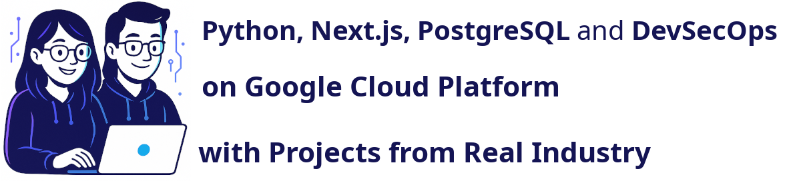

 

This repository contains projects and resources for mastering the 
Udemy Course `Python, Next.js, PostgreSQL and DevSecOps on Google Cloud Platform with Projects from Real Industry`.

Table of contents:
1. [🏠 Getting Started](#-1-getting-started)
2. [🛠️ Setup Development Environment (Software installation guide)](#%EF%B8%8F-2-setup-development-environment-software-installation-guide)
3. [📌 Technologies Covered](#-3-technologies-covered)
4. [🎯 Projects Included](#-4-projects-included)
5. [🛡️ DevSecOps](#%EF%B8%8F-5-devsecops)
6. [🔗 Links](#-6-links)
7. [📜 License](#-7-license)

---

## 🏠 1 Getting Started

 [Download ZIP](https://github.com/ditlef9/python-nextjs-postgresql-devsecops-gcp/archive/refs/heads/main.zip) of the course material
or use Git and clone the material:
```bash
git clone https://github.com/ditlef9/python-nextjs-postgresql-devsecops-gcp.git
```


---

## 🛠️ 2 Setup Development Environment (Software installation guide)

Select your operating system:

 [Windows Environment](setup-development-environment/windows-environment)<br>
 [Mac Environment](setup-development-environment/mac-environment)<br>
 [Ubuntu Environment](setup-development-environment/ubuntu-environment)<br>

---

## 📌 3 Technologies Covered
- **Google Cloud Platform (GCP)**: Run, Run Functions, IAM (Identity and Access Management), Buckets, Scheduler, Secrets, and more.
- **Python**: Backend development, API creation, automation, and security best practices.
- **Next.js**: Modern frontend framework for building scalable applications.
- **PostgreSQL**: Secure and scalable relational database management.
- **DevSecOps**: Security-first mindset, CI/CD, vulnerability scanning, and best practices.

---

## 🎯 4 Projects Included
| App                                  |  Language               | Runs on             | GCP Services                               | Description                                                |
|--------------------------------------|-------------------------|---------------------|--------------------------------------------|------------------------------------------------------------|
| 📝 [User Feedback Form](user-feedback-form)         | Next.js                 | Cloud Run           | Buckets                                    | Collects and stores user feedback securely.                |
| 🔄 [Versions Tracker](versions-tracker)           | Python                  | Cloud Run Functions | Buckets, Secrets, Scheduler and Email      | Fetches API data and posts updates to Email.               |
| 📝 [News Backend and Frontend](news) | Python (Flask), Next.js | Cloud Run           | PostgresSQL and Secrets                    | Backend API with user authentication and Next.js frontend. |
| 📄 [Report PDF-generation](report-pdf-generation)      | Python                  | Cloud Run Functions | Buckets, Scheduler, Secrets, Email         | Generates PDF reports from a flat database of JSON files.  |
| 📊 [Report Excel-generation](report-excel-generation)    | Python                  | Cloud Run Functions | Secrets, Buckets                           | Generates Excel reports from an API.                       |
| 🗒️ [Uptime App](uptime-app)          | Next.js                 | Cloud Run           | PostgresSQL, Email, Secrets and  Scheduler | Tracks and manages other applications uptime.              |


--- 

## 🛡️ 5 DevSecOps

DevSecOps is a software development approach that integrates security practices into every stage of the DevOps pipeline, 
ensuring faster, more secure application delivery.

* [Java GitHub Actions Files](devsecops/java/.github/workflows)
* [Next.js GitHub Actions Files](devsecops/next/.github/workflows)
* [Python GitHub Actions Files](devsecops/python/.github/workflows)


---

## 🔗 6 Links


---

## 📜 7 License


This project is licensed under the
[Creative Commons Attribution-NonCommercial-NoDerivatives 4.0 International License](https://creativecommons.org/licenses/by-nc-nd/4.0/).

**⚠️ Warning: Educational Material Only**

This repository contains projects and resources created for educational purposes as part of the Udemy course 
`Python, Next.js, PostgreSQL and DevSecOps on Google Cloud Platform with Projects from Real Industry`.

**This code is not intended for production use** and is provided **"as is"**. 
Use it at your own risk. No warranties or guarantees are provided, either express or implied. 

This material is **for students** enrolled in the course and is not meant to be used as part of any commercial product or service. 
Do not use the code as part of any production environment without thorough testing, modification, and security review.

