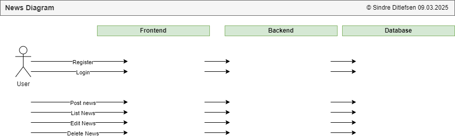
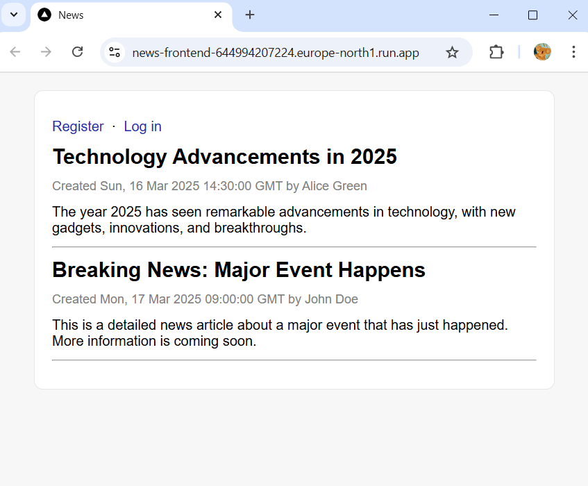
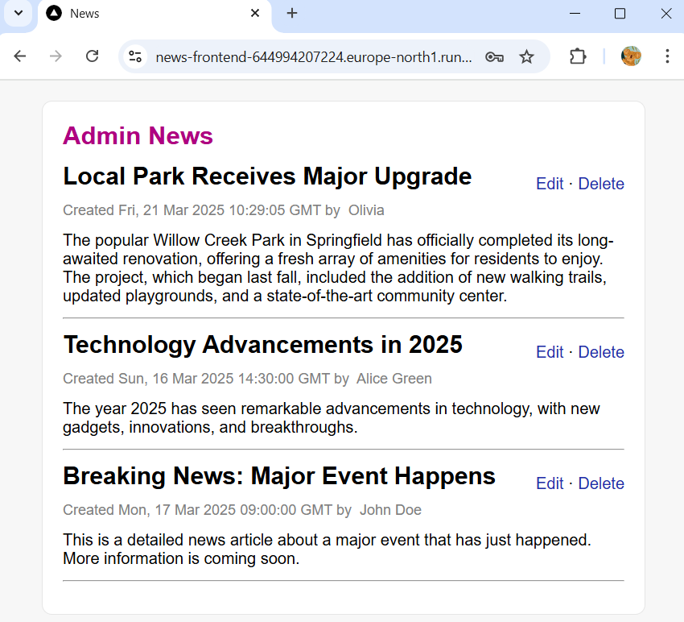
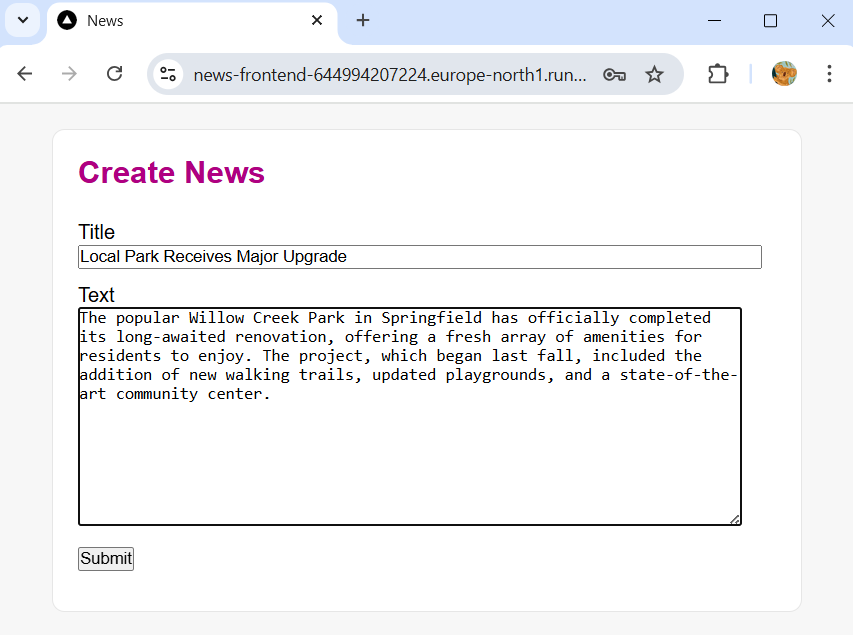
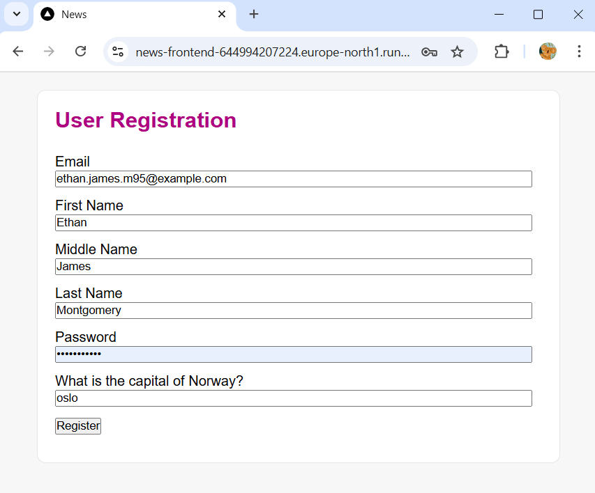
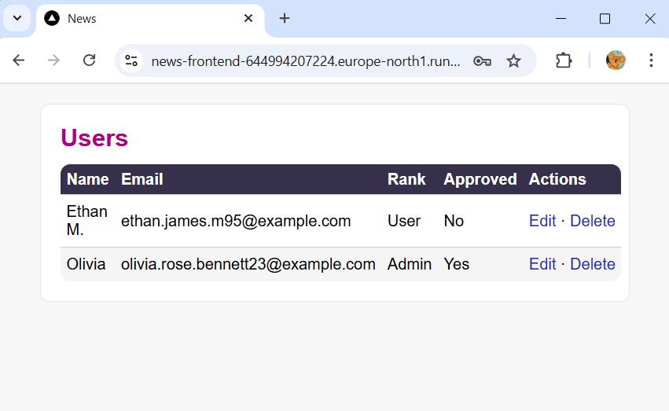
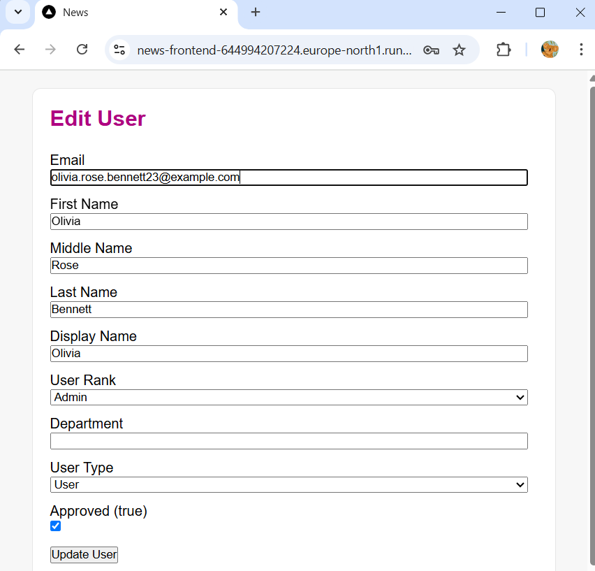

# 📝 News Backend and Frontend

[🏠 Home](../)
&nbsp; &nbsp;
[⬅ 🎯 Projects Included](../#-4-projects-included)

Backend API with user authentication and Next.js frontend.

| Category     | Details                 |          
|--------------|-------------------------|
| Tech         | Python (Flask), Next.js |
| Runs on      | Cloud Run               |
| GCP Services | PostgreSQL              |


Table of contents:
1. [📖 Learning Objectives for News backend and Frontend](#-1-learning-objectives-for-news-backend-and-frontend)
2. [✨ Lessons Overview for News backend and Frontend](#-2-lessons-overview-for-news-backend-and-frontend)
3. [📸 Diagram and Screenshots from News backend and Frontend](#-3-diagram-and-screenshots-from-versions-tracker)
4. [🐍 Creating Python Backend](#-4-creating-python-backend)
5. [⚛️ Creating Next.js Frontend](#%EF%B8%8F-5-creating-nextjs-frontend)
6. [🌐 Setting up Google Cloud Infrastructure for New backend and Frontend](#-6-setting-up-google-cloud-infrastructure-for-new-backend-and-frontend)
7. [🔗 Connecting to Database with pgAdmin](#-7-connecting-to-database-with-pgadmin)
8. [🛢️ Python DBAdapter](#%EF%B8%8F-8-python-dbadapter)
9. [📝 Register](#-9-register)
10. [🔑 Login](#-10-login)
11. [🏙️️ Admin](#%EF%B8%8F%EF%B8%8F-11-admin)
12. [📋 List users](#-12-list-users)
13. [🖊️ Edit user](#%EF%B8%8F-13-edit-user)
14. [❌ Delete user](#-14-delete-user)
15. [📰 Create news](#-15-create-news)
16. [📃 List news](#-16-list-news-on-homepage)
17. [📋 List news on admin on front end](#-17-list-news-on-admin-on-front-end)
18. [✏️ Edit news](#%EF%B8%8F-18-edit-news)
19. [🗑️ Delete news](#%EF%B8%8F-17-delete-news)
20. [🔒 Add CORS](#-20-add-cors)
21. [🖥️ Running the Finished News Backend and Frontend Locally](#%EF%B8%8F-21-running-the-finished-news-backend-and-frontend-locally)
22. [☁️ Running the Finished News Backend and Frontend on Google Cloud Run](#%EF%B8%8F-22-running-the-finished-news-backend-and-frontend-on-google-cloud-run)
23. [📜 License](#-23-license)

---

## 📖 1 Learning Objectives for News backend and Frontend

* Build a **Flask-based backend**  with user authentication and a PostgreSQL database.
* Develop a **Next.js frontend** to interact with the backend API.
* Deploy the application on Google Cloud using **Cloud Run** and **PostgreSQL**.
* **Secure APIs** and authentication with best practices.


---

## ✨ 2 Lessons Overview for News backend and Frontend


1. **Introduction**

2. **Creating Python Backend**<br>
- Setting up a Flask-based backend and structuring the project.
- Activity/Reflection: What challenges did you face while setting up the backend?


3. **Creating Next.js Frontend**<br>
- Setting up a Next.js project and creating the UI components.
- Activity/Reflection: How does the frontend connect with the backend?


4. **Setting up Google Cloud Infrastructure for New backend and Frontend**<br>
- Configuring Cloud Run, PostgreSQL, and Secret Manager.
- Activity/Reflection: What are the key advantages of deploying on Google Cloud?

5. **Connecting to database**<br>
- Establishing a secure connection between your computer and and PostgreSQL.
- Activity/Reflection: Why is database security important in production?


6. **Python DBAdapter**<br>
- Establishing a secure connection between Flask and PostgreSQL.
- Activity/Reflection: How can database abstraction improve maintainability?


7. **Register Backend**<br>
- Implementing user registration with validation and password hashing.
- Activity/Reflection: What security measures should be in place for user registration?

8. **Register Frontend**<br>
- Implementing user registration with validation and password hashing.
- Activity/Reflection: 

9. **Login Backend**<br>
- Authenticating users and managing sessions/tokens.
- Activity/Reflection: What authentication method did you choose and why?

10. **Login frontend**<br>
- Authenticating users and managing sessions/tokens.
- Activity/Reflection: 

11. **Admin**<br>
- Creating the admin dashboard
- Activity/Reflection: Can you style the ul and li ?

12. **List Users Backend**<br>
- Handle validate token and get all users in backend
- Activity/Reflection: 

13. **List Users Frontend**<br>
- List all users on the admin dashboard
- Activity/Reflection: 

14. **Edit user**<br>
- Edit a user on control panel
- Activity/Reflection: Can you add Change password function?
 
15. **Delete user**<br>
- Delete a user on control panel
- Activity/Reflection: 

16. **Create news**<br>
- Creating an API to add news articles with authentication.
- Activity/Reflection: What data validation checks are necessary for posting news?

17. **List news**<br>
- Implementing an API to fetch and display news articles.
- Activity/Reflection: Can you format the date time?

18. **List news on admin on front end**<br>
- Implement admin view with edit and delete function
- Activity/Reflection: 

19. **Edit news**<br>
- Allowing authorized users to update existing news articles.
- Activity/Reflection: How do you handle permissions for editing content?

20. **Delete news**<br>
- Implementing secure deletion of news articles.
- Activity/Reflection: What precautions should be taken when deleting records?

21. **Add CORS**<br>
- Make the backend only available from frontend
- Reflection: ?

22. **Congratulations and Learning Tip**<br>
- Learning tip: ?
- Reflection: ?

23. **Quiz**

---

## 📸 3 Diagram and Screenshots from News backend and Frontend

**News Backend and Frontend Diagram**<br>
This diagram shows the structure and flow, outlining its components and how user data is processed.<br>
 

**News Frontend**<br>
 

**News Admin View**<br>
 

**News Create View**<br>
 

**Registration form**<br>
 

**News Admin Users View**<br>
 

**News Admin Users Edit**<br>
 

---

## 🐍 4 Creating Python Backend


**1. Create new application in Github**

* Name: news-backend-python


**2. Open application in PyCharm**

Pycharm > File > Close Project<br><br>

Pycharm > Get from VCS<br><br>


**3. Create certificates**

Windows:
```
# Create the directories
mkdir src
mkdir src\certificates

# Change to the certificates directory
cd src\certificates

# Generate the SSL certificate using OpenSSL
openssl req -x509 -newkey rsa:4096 -keyout localhost_key.pem -out localhost_cert.pem -sha256 -days 365 -nodes -subj "/C=NO/ST=Oslo/L=Oslo/O=My Company/CN=example.com/emailAddress=admin@example.com"


```

Ubuntu:
```
mkdir src
mkdir src/certificates
cd src/certificates
openssl req -x509 -newkey rsa:4096 -keyout localhost_key.pem -out localhost_cert.pem -sha256 -days 365 -nodes -subj "/C=NO/ST=Oslo/L=Oslo/O=My Company/CN=example.com/emailAddress=admin@example.com"
```


**4. Create a index.html file**<br>

`src/static/index.html`

```html
<!DOCTYPE html>
<html lang="en-US">
<head>
    <title>It works</title>
    <link rel="shortcut icon" type="image/x-icon" href="favicon.ico">
    <style>
    /*- Body -------------------------------------------------------------------------- */
    html, body, div, span, object, iframe, img {
        margin:0;
        padding:0;
        border:0;
        outline:0;
        background:transparent;
    }
    html,body {
        margin:0;
        padding:0;
    }
    body {
        background: #f8f8f8;
        color: #000;
        font: normal 16px Helvetica, Arial, sans-serif, 'Open Sans';
    }
    /*- Headlines ----------------------------------------------------------------------- */
    h1{
        color: #272727;
        font: bold 21px Helvetica, Arial, sans-serif, 'Open Sans';

    }
    /*- Paragraph ----------------------------------------------------------------------- */
    p{
        color: #000000;
        font: normal 16px Helvetica, Arial, sans-serif, 'Open Sans';
    }
    /*- Main -------------------------------------------------------------------------- */
    main {
        background: #ffffff;
        border-radius: 25px;
        padding: 20px;
        margin: 0px auto;
        margin-top: 20px;
        margin-bottom: 20px;
        text-align: center;
        width: 500px;
    }
    @media screen and (max-width: 52.375em) {
        main{
            width: 90%;
        }
    }
    </style>
</head>
<body>


<main>
    <h1>It works</h1>
    <p>Welcome to the application</p>
</main>

</body>
</html>
```

**5. Create a favicon.ico file**<br>

Download favicon and add it to the `static` directory:

[favicon.ico](_docs/favicon.ico)

**6. Add requirements.txt**

```
bcrypt                      # Added by YOUR_NAME. Widely used hashing library for passwords in Python.
flask                       # Added by YOUR_NAME. Added by YOUR_NAME.A lightweight WSGI web application framework.
flask-cors                  # Added by YOUR_NAME. CORS (Cross-Origin Resource Sharing) support for Flask.
pg8000                      # Added by YOUR_NAME. A Pure Python database driver for PostgreSQL.
google-cloud-secret-manager # Added by YOUR_NAME. Google Cloud Secret Manager client library for Python.
cloud-sql-python-connector  # Added by YOUR_NAME. Connect to PostgresSQL from Google Cloud Run.
sqlalchemy                  # Added by YOUR_NAME. SQLAlchemy ORM and database toolkit for Python.
gunicorn                    # Added by YOUR_NAME. Gunicorn 'Green Unicorn' is a Python WSGI HTTP Server for UNIX.
pyjwt                       # Added by YOUR_NAME. Create JWT from Python.
```

**7. Create main.py**

```python
import os

from flask import Flask, send_from_directory
from pathlib import Path

# - Flask App -------------------------------------------------------------------
app = Flask(__name__)


# - General ----------------------------------------------------------------
@app.route('/', methods=['GET'])
def __index():
    print("__index() · Init")
    return send_from_directory(os.path.join(app.root_path, 'src/static'), 'index.html', mimetype='text/html')


@app.route('/favicon.ico')
def favicon():
    return send_from_directory(os.path.join(app.root_path, 'src/static'), 'favicon.ico', mimetype='image/vnd.microsoft.icon') # noqa


# - Main start ----------------------------------------------------------------
if __name__ == "__main__":

    # Developing or production?
    home = str(Path.home())
    home_array = home.split("\\")
    if home_array[0] in ["C:", "/Users/YOUR_MAC_OR_UBUNTU_USERNAME"]:
        # Run Database Migrations
        # db.run_migrations()

        # Developing mode
        print("main()·Flask API running in Developing Mode")

        # Start app
        app.run(debug=False, host="0.0.0.0", port=8080, ssl_context=('src/certificates/localhost_cert.pem', 'src/certificates/localhost_key.pem')) # noqa

    else:
        # Production mode
        print("main()·Flask API running in Production Mode")

        # Start app
        app.run(debug=False, host="0.0.0.0", port=8080)
```


**9. Setup venv**

Windows:
```commandline
python -m venv .venv
.venv\Scripts\activate 
```

Linux/Mac:
```commandline
python -m venv .venv
.venv/Scripts/activate 
```

**10. Install requirements**

PyCharm > Terminal:

`pip install -r requirements.txt`

**11. Run application**<br>
In PyCharm go to main.py and click `Run`


---

## ⚛️ 5 Creating Next.js Frontend


**1. Create new repository in Github**

* Name: **news-frontend-nextjs**

**2. Create new application**

Open CMD/Terminal and write:

```
mkdir next
cd next
npx create-next-app@latest
```

* What is your project name: **news**
* Would you like to use TypeScript: **Yes**
* Would you like to use ESLint: **Yes**
* Would you like to use Tailwind CSS: **No**
* Would you like yor code inside a `src/` directory: **No**
* Would you like to use App Router? (recommended): **Yes**
* Would you like to use Turbopack for `next dev`?: **No**
* Would you like to customize the import alias (`@/*` by default)?: **No**

**3. Initialize files to Github**

File > Terminal:

```
echo "# test" >> README.md
git init
git add README.md
git commit -m "first commit"
git branch -M main
git remote add origin https://github.com/YOUR_GITHUB_USERNAME/YOUR_GITHUB_REPOSITORY_NAME.git
git push -u origin main
```


**4. Add Dockerfile**

Add `Dockerfile` in the project with the following contents:

```
FROM node:alpine

WORKDIR /app

COPY package.json package-lock.json ./

RUN npm install

COPY . .

# Build the application (CHANGE-ME: NEXT_PUBLIC_BACKEND_API_URL)
ENV NODE_ENV=production
ENV NEXT_PUBLIC_BACKEND_API_URL=https://news-backend-sindre-test-644994207224.europe-north1.run.app

RUN npm run build

EXPOSE 3000

CMD ["npm", "start"]
```


**5. Start the application**

```
npm install
npm run dev
```

Open [http://localhost:3000](http://localhost:3000) with your browser to see the application.

---

## 🌐 6 Setting up Google Cloud Infrastructure for New backend and Frontend

### 6.1 Create PostgresSQL database

https://console.cloud.google.com > SQL > [Create Instance]<br>

* Choose your database engine: **PosgtreSQL**
* Choose a Cloud SQL edition: Enterprise
* Edition preset: Sandbox

**Instance info**<br>
* Database version: Latest
* Instance ID: cloud-postgres-prod
* Password: random password (https://my.norton.com/extspa/passwordmanager?path=pwd-gen)


**Choose region and zonal availability**<br>
* Region: europe-north1 (Finland)
* Zonal Availability: Single zone

**Machine configuration**<br>
* Machine shapes: Shared core
* 1 vCPI, 0.614 GB

**Storage**<br>
* Storage type: HDD
* Storage capacity: 10 GB

**Data protection**<br>
* Automated daily backups: Uncheck

**Labels**<br>
* owner = YOUR_NAME


### 6.2 Create secret

https://console.cloud.google.com > Secret Manager > + Create Secret

* Name: news-services
* Secret value:
```commandline
{
    "jwt_secret_key": "2mN7zOEq9CQonvqWxnhTkZbwAroYGdjl_8UyqK7iXKw=",
    "DB_CONNECTION_TYPE": "unix_socket",
    "DB_HOST": "127.0.0.1",
    "DB_USER": "postgres",
    "DB_PASS": "YOUR_SQL_PASSWORD",
    "DB_NAME": "postgres",
    "DB_PORT": "5432",
    "DB_INSTANCE_UNIX_SOCKET": "/cloudsql/GCP_PROJECT_ID:europe-north1:cloud-postgres-prod",
}
```

* Replication policy Locations: **europe-north1**
* Labels:
  * owner = YOUR_NAME
  * app = news


### 6.3 Give permissions to 

IAM > + Grant access 

* New principals: cloud-run-cloud-run-functions@applications-dev-453706.iam.gserviceaccount.com
* Role: Secret Manager Secret Accessor
* Role: Cloud SQL Client

### 6.4 Deploy backend
Cloud Run > Deploy Container > Service

Build Configuration:
* Build type: Python via Google Cloud's build packs

Configure:
* Service name: news-backend
* Region: europe-north1 (Finland)
* Authentication: Allow unauthenticated invocations
* Billing: Request based

Service Scaling
* Auto-scaling: Checked
* Minimum number of instances: 0

Containers > Resources:

* 128 MB (128Mi) and 1 CPU

If we do not use cold starts, then this table would help us use minimum resources:

| Memory         | CPU  | 
|----------------|------|
| 128 MB (128Mi) | 83m  |
| 256 MB (256Mi) | 167m |
| 512 MB (512Mi) | 333m |
| 1 GB (1GiB)    | 583m |


Containers > Revision scaling:
* Minimum number of instances: 0
* Maximum number of instances: 1

Cloud SQL connections:
* Cloud SQL instance 1: applications-dev:europe-north1:news-postgres-prod

Containers > Security:
* Service account: Cloud Run, Cloud Run Functions and Scheduler Service Account

Copy the URL to the backend, we are going to use it in the front end deployment.

### 6.5 Deploy frontend

Cloud Run > Deploy Container > Service

Build Configuration:
* Build type: Dockerfile

Configure:
* Service name: news-frontend
* Region: europe-north1 (Finland)
* Authentication: Allow unauthenticated invocations
* Billing: Request based

Service Scaling
* Auto-scaling: Checked
* Minimum number of instances: 0

Containers > Resources:
* Memory: 256 MB

Containers > Revision scaling:
* Minimum number of instances: 0
* Maximum number of instances: 1

Containers > Security:
* Service account: Cloud Run, Cloud Run Functions and Scheduler Service Account

Environment Variables:
* NEXT_PUBLIC_BACKEND_API_URL = https://news-backend-sindre-test-644994207224.europe-north1.run.app (Change to your URL)<br>
  (The NEXT_PUBLIC_BACKEND_API_URL is also referred to in the Dockerfile.)
* NEXTAUTH_SECRET = your_super_secret_key (https://auth-secret-gen.vercel.app)
* NEXTAUTH_URL = https://news-frontend-sindre-test-644994207224.europe-north1.run.app (Change to your URL)


---

## 🔗 7 Connecting to Database with pgAdmin

## 7.1 Create local database

pgAdmin > Servers > PostgreSQL X > Databases > [Right click] > Create: Database

* Database: cloud-dev

## 7.2 Connect to production database

**Add your network**<br>
Google Cloud Console > SQL > Connections > Networking > Authorised networks > [Add a network]

* Name: YOUR_NAME, YOUR_ADDRESS, YOUR_ISP (Example John Doe, 4567 Oak Avenue, Los Angeles, CA 90012, Spectrum Internet)
* Value: IP from https://whatismyipaddress.com/

**Download Certificates:**<br>

Google Cloud Console > SQL > cloud-prod > Connections > Security<br>

SSL Mode<br>
* Allow only SSL connections<br>

Manage client certificates
* Create Client Certificate
  * Client Certificate Name: YOUR_NAME - YOUR_COMPUTER_NAME (Example John Doe, Lenovo Ideapad Slim 3)
* Download the 3 generated files (client-key.pem, client-cert.pem and server-ca.pem)
* Save files to the pgadmin folder
  * Folder in unix systems: $HOME/.pgadmin/DB_NAME
    * `chmod 600 $HOME/.pgadmin/DB_NAME/*.pem`
  * Folder in Windows: C:\Program Files\PostgreSQL\DB_NAME


**Connect:**<br>

* pgAdmin > Servers > [Right click] > Register: Server
* Name: Retrieve from Google Cloud Console
* Port: 5432
* Username: postgres
* PARAMETERS
  * Add 3 new parameters and link them to the respective files:
    - Client certificate key > client-key.pem
    - Client certificate > client-cert.pem 
    - Root certificate > server-ca.pem


---

## 🛢️ 8 Python DBAdapter


### Setup
* Download `config.py` and edit fields.
* Download `src/dao/db_adapter.py`.
* Download `src/utils/google_secret_manager_access_secret_version.py`.
* Add `db = DBAdapter(migrations=False, debug=True)` and `db.migrations()`

### Create Migrations
* Create `src/migrations/users/users_index_001.sql`:
```sql
-- Users Index ------------------------------------------------
DROP TABLE IF EXISTS n_users_index;
CREATE TABLE IF NOT EXISTS public.n_users_index (
  user_id SERIAL PRIMARY KEY,
  user_email VARCHAR(255) NOT NULL,
  user_first_name VARCHAR(200),
  user_middle_name VARCHAR(200),
  user_last_name VARCHAR(200),
  user_display_name VARCHAR(200),
  user_password VARCHAR(255),
  user_mfa_type VARCHAR(255),
  user_mfa_code VARCHAR(255),
  user_login_code_value VARCHAR(255),
  user_login_code_valid_to_timestamp TIMESTAMP,
  user_is_approved BOOLEAN,
  user_rank VARCHAR(255), -- user, admin
  user_department VARCHAR(255),
  user_created_timestamp TIMESTAMP NOT NULL,
  user_created_by_user_id INT,
  user_updated_timestamp TIMESTAMP,
  user_updated_by_user_id INT,
  user_login_tries_count INT,
  user_login_tries_timestamp TIMESTAMP,
  user_login_timestamp TIMESTAMP,
  user_last_online_timestamp TIMESTAMP,
  user_last_ip VARCHAR(255),
  user_last_user_agent VARCHAR(255),
  user_type VARCHAR(50) -- user, service
);
```

* Create `src/migrations/news/news_index_001.sql`:
```sql
-- News Index ------------------------------------------------
DROP TABLE IF EXISTS n_news_index;
CREATE TABLE IF NOT EXISTS public.n_news_index (
  news_id SERIAL PRIMARY KEY,
  news_title VARCHAR(255) NOT NULL,
  news_title_slug VARCHAR(255) NOT NULL,
  news_text TEXT,
  news_created_timestamp TIMESTAMP NOT NULL,
  news_created_by_user_id INT,
  news_created_by_display_name VARCHAR(255),
  news_updated_timestamp TIMESTAMP,
  news_updated_by_user_id INT,
  news_updated_by_display_name VARCHAR(255)
);

-- Example News Entry 1
INSERT INTO public.n_news_index (
  news_title, 
  news_title_slug, 
  news_text, 
  news_created_timestamp, 
  news_created_by_user_id, 
  news_created_by_display_name, 
  news_updated_timestamp, 
  news_updated_by_user_id, 
  news_updated_by_display_name
) 
VALUES (
  'Breaking News: Major Event Happens', 
  'breaking-news-major-event-happens', 
  'This is a detailed news article about a major event that has just happened. More information is coming soon.',
  '2025-03-17 09:00:00',
  1,
  'John Doe',
  '2025-03-17 10:00:00',
  2,
  'Jane Smith'
);

-- Example News Entry 2
INSERT INTO public.n_news_index (
  news_title, 
  news_title_slug, 
  news_text, 
  news_created_timestamp, 
  news_created_by_user_id, 
  news_created_by_display_name, 
  news_updated_timestamp, 
  news_updated_by_user_id, 
  news_updated_by_display_name
) 
VALUES (
  'Technology Advancements in 2025', 
  'technology-advancements-in-2025', 
  'The year 2025 has seen remarkable advancements in technology, with new gadgets, innovations, and breakthroughs.',
  '2025-03-16 14:30:00',
  3,
  'Alice Green',
  NULL, -- No updates yet
  NULL, -- No updates yet
  NULL
);
```


* Run migrations on Google Cloud Run

---

## 📝 9 Register

### 9.1 Register Python Backend

* Implement src/api/users/register.py
* Add route to main.py

### 9.2 Register Next.js Frontend

* Copy `app/globals.css` (the same as we used in our user feedback form)
* Clean `app/layout.tsx`
* Clean `app/page.tsx`, add link to Register and Login
* Create layout `app/(public)/layout.tsx`
* Create page `app/(public)/register/page.tsx`

* Create .env.dev:
```
NEXT_PUBLIC_BACKEND_API_URL=https://127.0.0.1:8080
```
* Install dependencies:
```
npm install dotenv
```

* In the backend enable CORS by adding `CORS(app)`:
```
from flask import Flask, send_from_directory
from flask_cors import CORS


# - Flask App ----------------------------------------------------------------
app = Flask(__name__)
CORS(app) # Enables cors for routes

```
---

## 🔑 10 Login


### 10.1 Login Python Backend

* Implement src/api/users/login.py
* Add route to main.py

### 10.2 Login Next.js Frontend

* Install NextAuth: `npm install next-auth`
* Install jsonwebtoken: `npm install jsonwebtoken` and `npm i --save-dev @types/jsonwebtoken`
* Create api `app\api\auth\[...nextauth]\route.ts`
* Create lib `app/lib/auth.ts`
* Create lib `app/lib/loginIsRequiredServer.ts`
* Create lib `app/lib/useLoginRequiredClient.ts`
* Create types `app/types/next-auth.d.ts`
* Create page `app/(public)/login/page.tsx`

Edit .env.development and add:
```
NEXT_PUBLIC_BACKEND_API_URL=https://127.0.0.1:8080
NODE_TLS_REJECT_UNAUTHORIZED=0
NEXT_AUTH_SECRET=F7Bb0yRDIKLp3Op6jos0iJhhJiKBgDPJQPazYJSXscc= # openssl rand -base64 32
```


---

## 🏙️️ 11 Admin

* Create `api/(private)/layout.tsx`
* Create `api/(private)/admin/page.tsx`

---

## 📋 12 List users

### List users backend

* Implement `src/utils/validate_token.py` - Reflection: What will happen if I steal the token and use it from a machine in another country?
* Implement `src/api/users/get_users.py`

### List users frontend

* Implement `app/(public)/users/page.tsx`

---
## 🖊️ 13 Edit user

### Edit user backend

* Implement `src/api/users/get_user.py`
* Implement `src/api/users/edit_user.py`

### Edit user frontend

* Implement `app/(public)/users/[userId]/edit/page.tsx`


Assignment/Reflection: Can you implement a change password function?
* Backend: `src/api/users/edit_user_password.py`
* Frontend: `app/(public)/users/[userId]/edit-password/page.tsx`

---

## ❌ 14 Delete user

### Delete user backend

* Implement `src/api/users/delete_user.py`

### Edit user frontend

* Implement `app/(public)/users/[userId]/delete/page.tsx`

---

## 📰 15 Create news

### Create news backend

* Implement `src/api/news/create_news.py`

### Create news frontend

* Implement `app/(private)/admin/news/create-news/page.tsx`

---

## 📃 16 List news on homepage


### Create news backend

* Implement `src/api/news/get_all_news.py`

### Create news frontend

* Update `app/page.tsx`

---

## 📋 17 List news on admin on front end


* Implement `app/(private)/admin/news/page.tsx`

---

## ✏️ 18 Edit news


### Edit news backend

* Implement `src/api/news/get_single_news.py`
* Implement `src/api/news/edit_news.py`

### Create news frontend

* Implement `app/(private)/admin/news/[newsId]/edit-news/page.tsx`


---

## 🗑️ 19 Delete news


### Edit news backend

* Implement `src/api/news/delete_news.py`

### Create news frontend

* Implement `app/(private)/admin/news/[newsId]/delete-news/page.tsx`


---

## 🔒 20 Add CORS

main.py:<br>

Change<br>

```
app = Flask(__name__)
CORS(app)  # Enable CORS for all routes
```

with:<br>

```
app = Flask(__name__)
CORS(app, origins=["http://localhost:3000", "https://news-frontend-644994207224.europe-north1.run.app"])
```


---

## 🖥️ 21 Running the Finished News Backend and Frontend Locally

## Python backend locally

1. Clone the repository
2. Create pgAdmin database: `news-dev`
3. Edit `config_project.py`: `GOOGLE_CLOUD_PROJECT_ID`
4. Run main.py

## Next.js frontend locally

1. Clone the repository
2. Copy `env.example to` `.env.development`
3. Edit `.env.development`: `NEXTAUTH_SECRET`
4. Edit `Dockerfile`: `ENV NEXT_PUBLIC_BACKEND_API_URL`
5. Run `npm install` and `npm run dev`

---

## ☁️ 22 Running the Finished News Backend and Frontend on Google Cloud Run

Please see 
🌐 6 Setting up Google Cloud Infrastructure for New backend and Frontend


---

## 📜 23 License


This project is licensed under the
[Creative Commons Attribution-NonCommercial-NoDerivatives 4.0 International License](https://creativecommons.org/licenses/by-nc-nd/4.0/).

**⚠️ Warning: Educational Material Only**

This repository contains projects and resources created for educational purposes as part of the Udemy course 
`Python, Next.js, PostgreSQL and DevSecOps on Google Cloud Platform with Projects from Real Industry`.

**This code is not intended for production use** and is provided **"as is"**. 
Use it at your own risk. No warranties or guarantees are provided, either express or implied. 

This material is **for students** enrolled in the course and is not meant to be used as part of any commercial product or service. 
Do not use the code as part of any production environment without thorough testing, modification, and security review.

