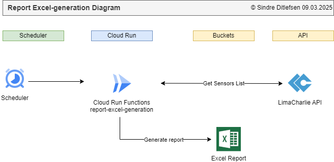
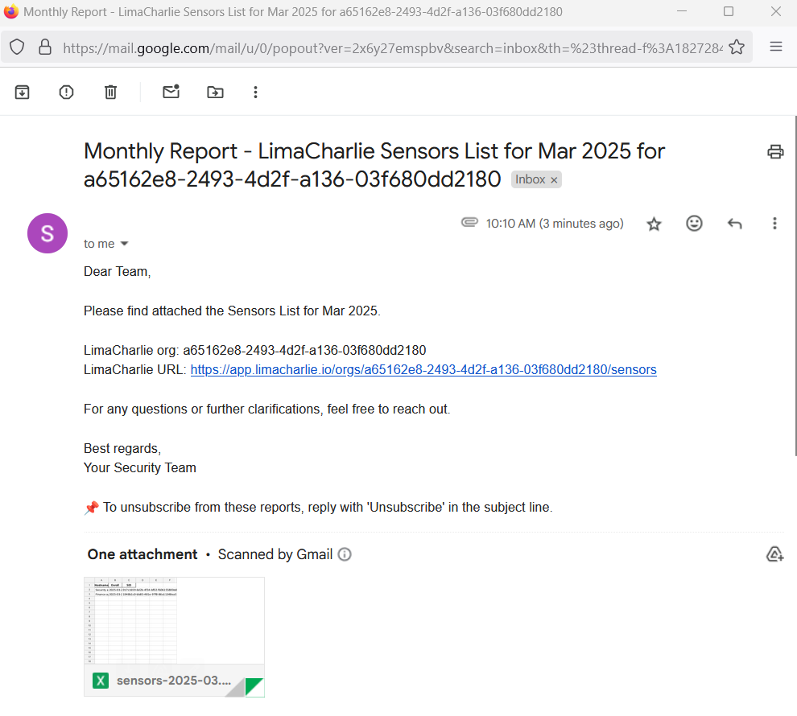
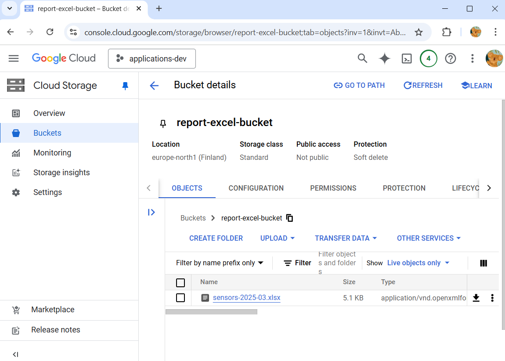
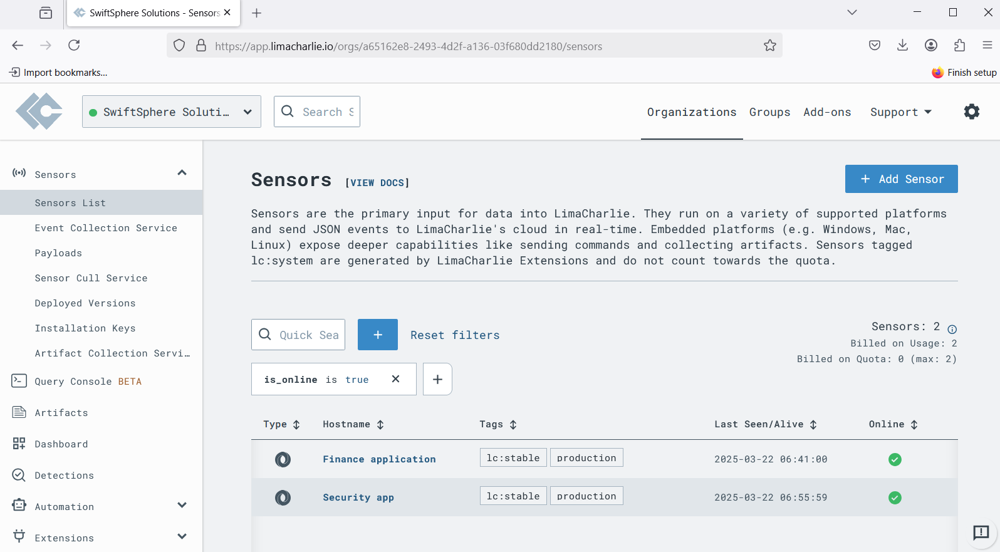
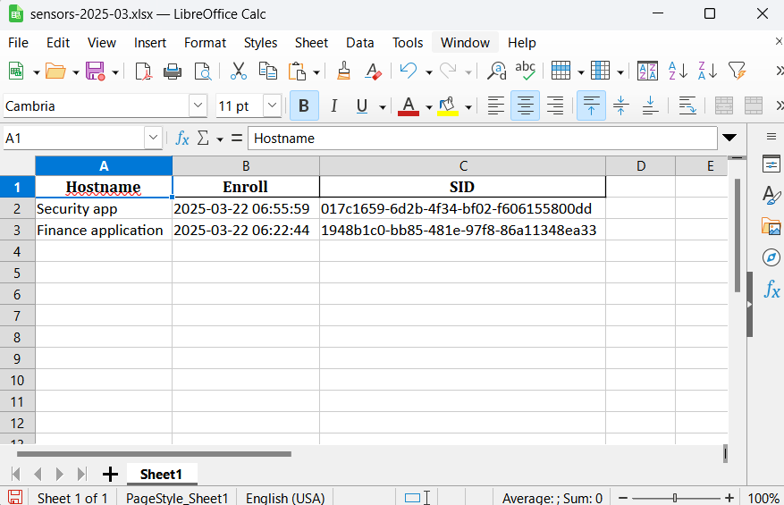

# 📊 Report Excel-generation

[🏠 Home](../)
&nbsp; &nbsp;
[⬅ 🎯 Projects Included](../#-4-projects-included)

Generates Excel reports from stored data.

| Category     | Details                            |          
|--------------|------------------------------------|
| Tech         | Python, Rest API                   |
| Runs on      | Cloud Run Functions                |
| GCP Services | Buckets, Scheduler, Secrets, Email |


Table of contents:
1. [📖 Learning Objectives for Report Excel-generation](#-1-learning-objectives-for-report-excel-generation)
2. [✨ Lessons Overview for Report Excel-generation](#-2-lessons-overview-for-report-excel-generation)
3. [📸 Diagram and Screenshots from Report Excel-generation](#-3-diagram-and-screenshots-from-report-excel-generation)
4. [🐍 Creating Python Report Excel-generation](#-4-creating-python-report-excel-generation)
5. [🌐 Setting up Google Cloud Infrastructure for Report Excel-generation](#-5-setting-up-google-cloud-infrastructure-for-report-excel-generation)
6. [🏃‍♂️ Deploy application to Google Cloud Functions using a GitHub Action File](#%EF%B8%8F-6-deploy-application-to-google-cloud-functions-using-a-github-action-file)
7. [🧪 Getting a LimaCharlie organization](#-7-getting-a-limacharlie-organization)
8. [🔗 Connecting to LimaCharlie REST API using Postman](#-8-connecting-to-limacharlie-rest-api-using-postman)
9. [🔒 Authenticate](#-9-authenticate)
10. [📄 Getting sensors](#-10-getting-sensors)
11. [📊 Creating Excel with sensors](#-11-creating-excel-with-sensors)
12. [☁️ Uploading Excel to Buckets](#%EF%B8%8F-12-uploading-excel-to-buckets)
13. [📧 Sending Excel as email](#-13-sending-excel-as-email)
14. [🖥️ Running the Report Excel-generation Locally](#%EF%B8%8F-14-running-the-report-excel-generation-locally)
15. [☁️ Running the Report Excel-generation on Google Cloud Run Functions](#%EF%B8%8F-15-running-the-report-excel-generation-on-google-cloud-run-functions)
16. [📜 License](#-16-license)

---

## 📖 1 Learning Objectives for Report Excel-generation

By the end of this module, you will learn how to:

* Connect to a REST API with Python
* Authenticate to a REST API and using Bearer token (JWT token)
* Create a spreadsheet with Python

---

## ✨ 2 Lessons Overview for Report Excel-generation


1. **Introduction**

2. **Creating Python Backend**<br>
- Implementing core functionality for Python application
- Activity/Reflection


3. **Setting up Google Cloud Infrastructure for Report Excel Generation**<br>
- Creating and configuring Google Cloud resources (Cloud Functions, Buckets, Scheduler, and Secret Manager).
- Activity/Reflection

4. **Deploy application to Google Cloud Functions using a GitHub Action File**<br>
- We will create a GitHub Actions file that deploys the application
- Activity/Reflection

5. **Getting a LimaCharlie organization**<br>
- Signing up at LimaCharlie and adding two sensors.
- Activity/Reflection

6. **Connecting to LimaCharlie REST API using Postman**<br>
- How to get a Bearer token
- Activity/Reflection

7. **Authenticate**<br>
- Authenticate with Python
- Activity/Reflection

8. **Getting sensors**<br>
- Listing sensors with Rest API
- Activity/Reflection

9. **Creating Excel with sensors**<br>
- Createing a spreadsheet using Python
- Activity/Reflection

10. **Uploading Excel to Buckets**<br>
- Uploading the spreadsheet to buckets
- Activity/Reflection

11. **Sending Excel as email**<br>
- Sending spreadsheet as email to receivers using Gmail
- Activity/Reflection

12. **Congratulations and Learning Tip**<br>
- Learning tip: Apply what you learn to real-world scenarios or personal projects. Hands-on experience reinforces concepts better than passive learning.
- Reflection: How can you integrate automation into your daily workflow to improve efficiency?

13. **Quiz**


---

# 📸 3 Diagram and Screenshots from Report Excel-generation

**Report Excel Diagram**<br>
A scheduler wil start the function every month. This starts a function that will get a list of sensors, and
put it into a spreadsheet.<br>
 

**Email with Excel report**<br>
The report is sent to receivers email address with the spreadsheet as attachment.<br>
 

**Buckets**<br>
The spreadsheet is uploaded to Google Cloud Buckets.<br>
 

**Limacharlie**<br>
The spreadsheet contains a list of sensors.<br>
 

**Spreadsheet**<br>
Image of spreadsheet.<br>
 

---

## 🐍 4 Creating Python Report Excel-generation


**1. Create new repository in Github**

* https://github.com/new
* Name: report-excel-python-gcp 
* Description: Generate Excel report from a REST API.

**2. Open application in PyCharm**

Pycharm > File > Close Project<br><br>

Pycharm > Clone Repository<br><br>


**3. Add requirements.txt**

```
functions-framework         # Added by YOUR_NAME. Framework for running Google Cloud Functions locally
flask                       # Added by YOUR_NAME. Micro web framework for building web applications.
google-cloud-storage        # Added by YOUR_NAME. Interact with Google Cloud Storage for file operations.
google-cloud-secret-manager # Added by YOUR_NAME. Read and write secrets to Google Cloud
pandas                      # Added by YOUR_NAME. Library used for , data manipulation and analysis.
openpyxl                    # Added by YOUR_NAME. Required by pandas to save Excel files.
```

**4. Create main.py**

```python


import flask
import functions_framework

@functions_framework.http
def main(request: flask.wrappers.Request):
    """HTTP Cloud Function"""
    log_headline: str = f"main()"
    print(f"{log_headline} · Init")


if __name__ == '__main__':
    print("report-excel-generation local run")

    app = flask.Flask(__name__)  # Create a Flask app instance
    request = flask.request
    main(request)
```


**5. Setup venv**

Windows:
```commandline
python -m venv .venv
.venv\Scripts\activate 
```

Linux/Mac:
```commandline
python -m venv .venv
.venv/Scripts/activate 
```


**6. Install requirements**

PyCharm > Terminal:

`pip install -r requirements.txt`

**7. Run application**<br>

PyCharm > Edit Configurations > Python

* Name: **main**
* Script: **main.py**
* Environment variables: PYTHONUNBUFFERED=1;**GOOGLE_CLOUD_PROJECT_ID=applications-dev-453706**

In PyCharm click `Run`


---

## 🌐 5 Setting up Google Cloud Infrastructure for Report Excel-generation


### Create Bucket

Google Cloud > Buckets > New

* Name: report-excel-bucket
* Labels: owner: YOUR_NAME
* Location type: Region

Add rule:
* Auto delete after 7 days.


### Publish Application

Change `applications-dev-453706` with your Google Cloud project ID.

```commandline
gcloud auth login
gcloud functions deploy report-excel --gen2 --runtime=python312 --region=europe-north1 --source=. --entry-point=main --trigger-http --timeout=540 --verbosity=info --project=applications-dev-453706 --memory=256Mi --set-env-vars=GOOGLE_CLOUD_PROJECT_ID=applications-dev-453706
```

### Add Scheduler

Google Cloud > Scheduler > Create Job

Define the schedule:

* Name: **report-excel-monthly-report**
* Region: **europe-west1 (Belgium)**
* Description: **Generates a report**
* Frequency: `0 0 1 * *` (At 00:00 on day-of-month 1.)
* Time zone: **Central European Standard Time (CET)**

Configure the execution:

* Target type: **HTTP**
* URL: **https://news-frontend-644994207224.europe-north1.run.app** (Change with your url)
* Auth header: **Add OIDC token**
* Service account: **Cloud Run Functions and Scheduler Service Account**
* Scope: **https://news-frontend-644994207224.europe-north1.run.app** (Change with your url)

[Create]

### Create secret

* Create secret `report-excel-services` (you can copy `what-version-services`)<br>
```json
{
"gmail_sender_email": "YOU@gmail.com",
"gmail_app_password": "CHANGE ME",
"recipient_email_addresses": "YOU@gmail.com",
"limacharlie_organization_id": "We will enter this later",
"limacharlie_api_key": "We will enter this later"
}
```


## 🏃‍♂️ 6 Deploy application to Google Cloud Functions using a GitHub Action File

**Safety**<br>
* Go to https://platform.safetycli.com/auth/pages/platform-auth-start/ and create an account
* Create an API key at https://platform.safetycli.com/organization/apikeys
* Then add your SAFETY API KEY into Github Secret as `SAFETY_API_KEY`
* Run it manually one time to get a `.safety-project.ini`. This file must be committed to Github.
```
pip install safety 
safety auth
safety scan
```

**Github Actions File**<br>
* [.github/workflows/python-linting-security-gcp-deploy.yaml](https://github.com/ditlef9/python-nextjs-postgresql-devsecops-gcp/blob/main/devsecops/python/.github/workflows/python-linting-security-gcp-deploy.yaml)
* Change `APP_NAME`
* Change `GOOGLE_CLOUD_PROJECT_ID`
* Make sure your Google Cloud Deploy Service account exists under Github Secret `ACTIONS_AUTH_GOOGLE_CLOUD`

---


---

## 🧪 7 Getting a LimaCharlie organization

**Create LimaCharlie organization**<br>
1. https://app.limacharlie.io
2. Create an organization
3. Copy organization from URL https://app.limacharlie.io/orgs/**b65162e2-3493-5d2f-a236-03f690dd9180** to secret `report-excel-services`


**Generate REST API Key**<br>
1. Access management > REST API > Create API Key
* Permissions: sensor.get and sensor.list
* Name: report-excel

2. Copy the API key into `limacharlie_api_key` to secret `report-excel-services`.

**Create two adapters**<br>
1. Sensors > Sensors List > Add Sensor
* JSON Logs > (Create an Installation key) 
* Key Name: Apps
* Ingest Method: Events received through LimaCharlie webhooks
* Adapter Name: Report Excel Generation Application
* Secret: Random Secret

2. Sensors > Sensors List > Add Sensor
* JSON Logs > Key: Apps
* Ingest Method: Events received through LimaCharlie webhooks
* Adapter Name: Uptime app
* Secret: Random Secret

---

## 🔗 8 Connecting to LimaCharlie REST API using Postman

* Download and install Postman
* Open documentation: https://api.limacharlie.io/static/swagger/

1 Authenticate
  * https://app.limacharlie.io/jwt
  * headers:
    * Content-Type: application/json
  * body:
    * oid: LIMACHARLIE_ORGANIZATION_ID
    * secret: LIMACHARLIE_API_KEY

2 List sensors
  * https://api.limacharlie.io/v1/sensors/LIMACHARLIE_ORGANIZATION_ID
  * headers:
    * Content-Type: application/json
    * Authorization: Bearer ey....


---

## 🔒 9 Authenticate

* Copy src/utils/google_secret_manager_access_secret_version.py
* Implement src/limacharlie/auth_limacharlie.py

---

## 📄 10 Getting sensors

* Implement src/limacharlie/sensors_list.py


---

## 📊 11 Creating Excel with sensors

* Copy src/utils/get_datetime.py
* Implement src/spreadsheet/spreadsheet.py

---

## ☁️ 12 Uploading Excel to Buckets

* Copy src/utils/google_bucket_storage_client_and_get_bucket.py
* Copy src/utils/google_bucket_write_from_filename.py
* Implement upload in main.py

---

## 📧 13 Sending Excel as email

* Copy src/utils/send_gmail_app_pass.py
* Implement src/email/send_email.py
---

## 🖥️ 14 Running the Report Excel-generation Locally

**1. Clone the repository**


**2. Open the directory `report-excel-python-gcp` in PyCharm**


**3. Install requirements**

PyCharm > Terminal:

`pip install -r requirements.txt`

**4. Start the application**<br>
In PyCharm go to main.py and click `Run`


---

## ☁️ 15 Running the Report Excel-generation on Google Cloud Run Functions


Please see `Setting up Google Cloud Infrastructure for Report Excel-generation`.

---

## 📜 16 License


This project is licensed under the
[Creative Commons Attribution-NonCommercial-NoDerivatives 4.0 International License](https://creativecommons.org/licenses/by-nc-nd/4.0/).

**⚠️ Warning: Educational Material Only**

This repository contains projects and resources created for educational purposes as part of the Udemy course 
`Python, Next.js, PostgreSQL and DevSecOps on Google Cloud Platform with Projects from Real Industry`.

**This code is not intended for production use** and is provided **"as is"**. 
Use it at your own risk. No warranties or guarantees are provided, either express or implied. 

This material is **for students** enrolled in the course and is not meant to be used as part of any commercial product or service. 
Do not use the code as part of any production environment without thorough testing, modification, and security review.

