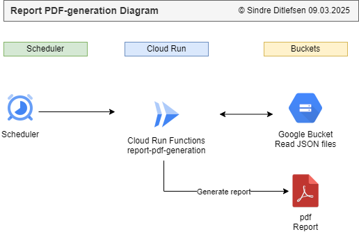
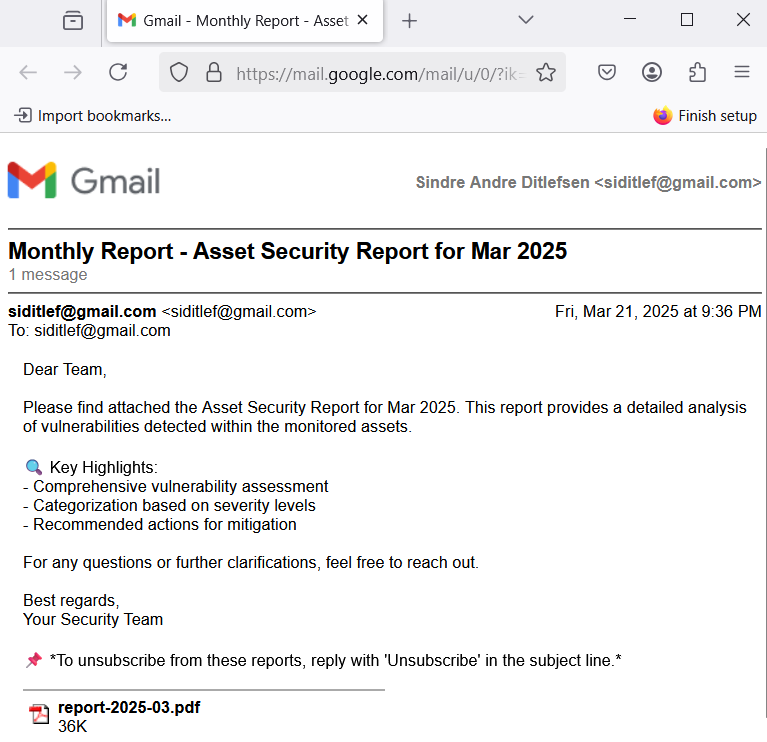
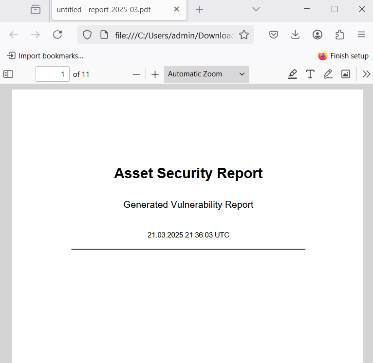
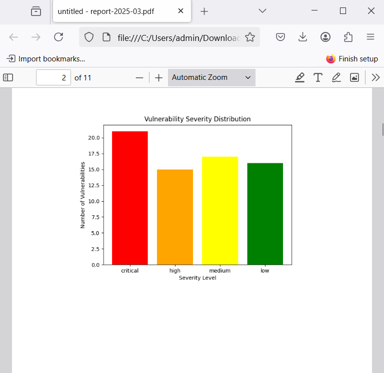
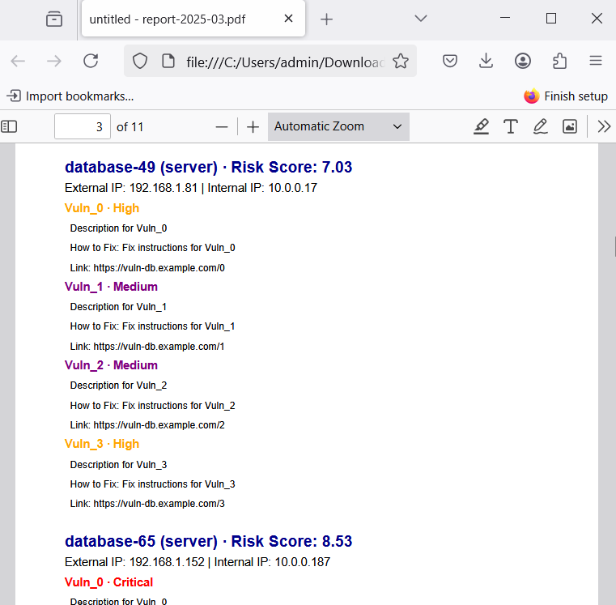
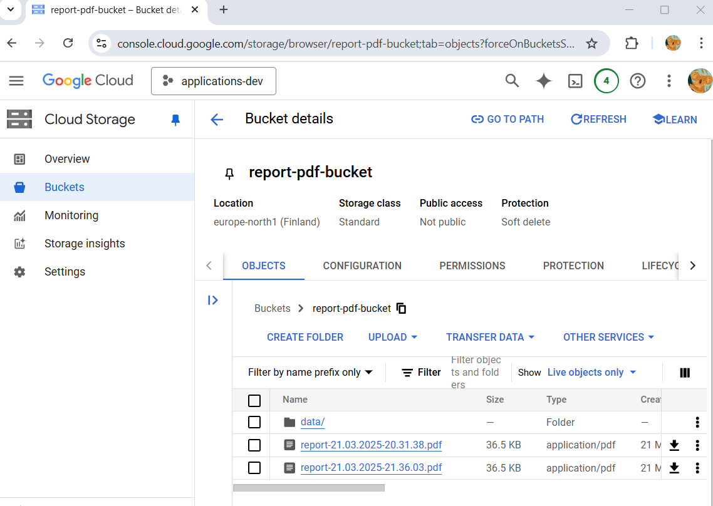

# 📄 Report PDF-generation

[🏠 Home](../)
&nbsp; &nbsp;
[⬅ 🎯 Projects Included](../#-4-projects-included)

Generates PDF reports from stored data.

| Category     | Details                            |          
|--------------|------------------------------------|
| Tech         | Python                             |
| Runs on      | Cloud Run Functions                |
| GCP Services | Buckets, Scheduler, Secrets, Email |


Table of contents:
1. [📖 Learning Objectives for Report PDF-generation](#-1-learning-objectives-for-report-pdf-generation)
2. [✨ Lessons Overview for Report PDF-generation](#-2-lessons-overview-for-report-pdf-generation)
3. [📸 Diagram and Screenshots from Report PDF-generation](#-3-diagram-and-screenshots-from-report-pdf-generation)
4. [🐍 Creating Python Report PDF-generation](#-4-creating-python-report-pdf-generation)
5. [🌐 Setting up Google Cloud Infrastructure for Report PDF-generation](#-5-setting-up-google-cloud-infrastructure-for-report-pdf-generation)
6. [🧪 Generating test data: Assets and their vulnerabilities (critical, high, medium, low)](#-6-generating-test-data-assets-and-their-vulnerabilities-critical-high-medium-low)
7. [📄 Creating PDF](#-7-creating-pdf)
8. [📄 Creating PDF with Vulnerabilities](#-8-creating-pdf-with-vulnerabilities)
9. [📊 Adding a barchart](#-9-adding-a-barchart)
10. [☁️ Uploading PDF to Buckets](#%EF%B8%8F-9-uploading-pdf-to-buckets)
11. [📧 Sending PDF as email](#-10-sending-pdf-as-email)
12. [🖥️ Running the Report PDF-generation Locally](#%EF%B8%8F-11-running-the-report-pdf-generation-locally)
13. [☁️ Running the Report PDF-generation on Google Cloud Run Functions](#%EF%B8%8F-12-running-the-report-pdf-generation-on-google-cloud-run)
14. [📜 License](#-14-license)

---

## 📖 1 Learning Objectives for Report PDF-generation

By the end of this module, you will learn how to:

* Generate security reports in PDF format. 
* Deploy a Python app to Google Cloud Run Functions.
* Automate email notifications with attachments.

---

## ✨ 2 Lessons Overview for Report PDF-generation

1. **Introduction**

2. **Creating Python Backend**<br>
- Implementing core functionality for Python applicaiton
- Activity/Reflection


3. **Setting up Google Cloud Infrastructure for Report PDF-generation**<br>
- Creating and configuring Google Cloud resources (Cloud Functions, Buckets, Scheduler, and Secret Manager).
- Activity/Reflection

4. **Generating test data: Assets and their vulnerabilities (critical, high, medium, low)**<br>
- Structuring mock asset and vulnerability data.
- Activity/Reflection

5. **Creating PDF**<br>
- Using ReportLab to generate PDF reports.
- Activity/Reflection

6. **Creating PDF with Vulnerabilities**<br>
- Integrating test data into the PDF report
- Activity/Reflection

7. **Adding a barchart**<br>
- Embedding a chart in the PDF report.
- Activity/Reflection

8️. **Uploading PDF to Buckets**<br>
- Storing generated PDFs in Google Cloud Storage.
- Activity/Reflection

9. **Sending PDF as email**<br>
- Attaching the generated PDF and sending automated emails.
- Activity/Reflection

10. **Congratulations and Learning Tip**<br>
- Learning tip: When learning new technologies, break down complex tasks into smaller, manageable steps. 
- Reflection: What are some other use cases where automated reporting and cloud storage can be beneficial?

11. **Quiz**

---

## 📸 3 Diagram and Screenshots from Report PDF-generation


**Report PDF-generation Diagram**<br>
This diagram shows the structure and flow, outlining its components and how user data is processed.<br>
 

**Report PDF email**<br>
The report is sent to the user by email.<br>
 

**Report PDF page 1,2 and 3**<br>
The report has a first page, bar chart and listing of servers and their vulnerabilities<br>
 
 
 

**Report is stored in Google Cloud Bucket**<br>
The report is stored in Google Cloud Bucket, and the data is also stored there.<br>
 

---

## 🐍 4 Creating Python Report PDF-generation


**1. Create new repository in Github**

**2. Open application in PyCharm**

Pycharm > File > Close Project<br><br>

Pycharm > Get from VCS<br><br>


**3. Add requirements.txt**

```
functions-framework         # Added by YOUR_NAME. Framework for running Google Cloud Functions locally
flask                       # Added by YOUR_NAME. Micro web framework for building web applications.
google-cloud-storage        # Added by YOUR_NAME. Interact with Google Cloud Storage for file operations.
google-cloud-secret-manager # Added by YOUR_NAME. Read and write secrets to Google Cloud
matplotlib                  # Added by YOUR_NAME. Plotting and data visualization library.
numpy                       # Added by YOUR_NAME. Library for numerical computation.
reportlab                   # Added by YOUR_NAME. To generate PDF.

```

**4. Create main.py**

```python


import flask
import functions_framework

@functions_framework.http
def main(request: flask.wrappers.Request):
    """HTTP Cloud Function"""
    log_headline: str = f"main()"
    print(f"{log_headline} · Init")


if __name__ == '__main__':
    print("report-pdf local run")

    app = flask.Flask(__name__)  # Create a Flask app instance
    request = flask.request
    main(request)
```

**5. Install requirements**

PyCharm > Terminal:

`pip install -r requirements.txt`

**6. Set environment variable and Run application**<br>

PyCharm > Edit Configurations > Python

* Name: **main**
* Script: **main.py**
* Environment variables: PYTHONUNBUFFERED=1;**GOOGLE_CLOUD_PROJECT_ID=applications-dev-453706**


In PyCharm click `Run`


---

## 🌐 5 Setting up Google Cloud Infrastructure for Report PDF-generation

### Create Bucket

Google Cloud > Buckets > New

* Name: report-pdf-bucket
* Labels: owner: YOUR_NAME
* Location type: Region

Add rule:
* Auto delete after 7 days.


### Publish Application

Change `applications-dev-453706` with your Google Cloud project ID.

```commandline
gcloud auth login
gcloud functions deploy report-pdf --gen2 --runtime=python312 --region=europe-north1 --source=. --entry-point=main --trigger-http --timeout=540 --verbosity=info --project=applications-dev-453706 --memory=256Mi --set-env-vars=GOOGLE_CLOUD_PROJECT_ID=applications-dev-453706
```

### Add Scheduler

Google Cloud > Scheduler > Create Job

Define the schedule:

* Name: **report-pdf-monthly-report**
* Region: **europe-west1 (Belgium)**
* Description: **Generates a report**
* Frequency: `0 0 1 * *` (At 00:00 on day-of-month 1.)
* Time zone: **Central European Standard Time (CET)**

Configure the execution:

* Target type: **HTTP**
* URL: **https://news-frontend-644994207224.europe-north1.run.app** (Change with your url)
* Auth header: **Add OIDC token**
* Service account: **Cloud Run Functions and Scheduler Service Account**
* Scope: **https://news-frontend-644994207224.europe-north1.run.app** (Change with your url)

[Create]

### Create secret

* Create secret `report-pdf-services` (you can copy `what-version-services`)<br>
```json
{
"gmail_sender_email": "YOU@gmail.com",
"gmail_app_password": "CHANGE ME",
"recipient_email_addresses":   "YOU@gmail.com"
}
```

---

## 🧪 6 Generating test data: Assets and their vulnerabilities (critical, high, medium, low)

* Implement `src/test_data/generate_test_data.py`


---

## 📄 7 Creating PDF

* Implement `src/application/a_delete_old/a_delete_old.py`
* Implement `src/application/b_create_tmp/b_create_tmp.py`
* Implement `src/application/c_generate_pdf/c_generate_pdf.py`
* Implement `src/application/x_save_pdf/x_save_pdf.py`

---

## 📄 8 Creating PDF with Vulnerabilities

* Load bucket:

```
# Load bucket
bucket = google_bucket_storage_client_and_get_bucket(bucket_name="report-pdf-bucket")
```

* Implement `src/application/e_assets/e_assets.py`
* Implement `src/application/e_assets/helpers/load_assets.py`

---

## 📊 9 Adding a barchart

* Implement `src/utils/d_graph_severity/d_graph_severity.py`
* Implement `src/utils/d_assets.py/helpers/graphs/draw_bar_chart.py`


---


## ☁️ 10 Uploading PDF to Buckets

* Implement `src/application/y_upload_to_bucket/y_upload_to_bucket.py`

---

## 📧 11 Sending PDF as email

* Implement `src/utils/google_secret_manager_access_secret_version.py`
* Implement `src/utils/send_gmail_app_pass.py`
* Implement `src/z_send_email/z_send_email.py`
* Create secret `report-pdf-services` (you can copy `what-version-services`)<br>
```json
{
"gmail_sender_email": "YOU@gmail.com",
"gmail_app_password": "CHANGE ME",
"recipient_email_addresses":   "YOU@gmail.com"
}
```
---


## 🖥️ 12 Running the Report PDF-generation Locally

**1. Clone the repository**


**2. Open the directory `news-backend` in PyCharm**


**3. Install requirements**

PyCharm > Terminal:

`pip install -r requirements.txt`

**4. Start the application**<br>
In PyCharm go to main.py and click `Run`


---

## ☁️ 13 Running the Report PDF-generation on Google Cloud Run Functions

Please see `🌐 Setting up Google Cloud Infrastructure for Report PDF-generation`.

---

## 📜 14 License


This project is licensed under the
[Creative Commons Attribution-NonCommercial-NoDerivatives 4.0 International License](https://creativecommons.org/licenses/by-nc-nd/4.0/).

**⚠️ Warning: Educational Material Only**

This repository contains projects and resources created for educational purposes as part of the Udemy course 
`Python, Next.js, PostgreSQL and DevSecOps on Google Cloud Platform with Projects from Real Industry`.

**This code is not intended for production use** and is provided **"as is"**. 
Use it at your own risk. No warranties or guarantees are provided, either express or implied. 

This material is **for students** enrolled in the course and is not meant to be used as part of any commercial product or service. 
Do not use the code as part of any production environment without thorough testing, modification, and security review.

