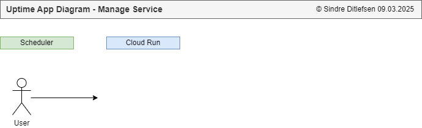
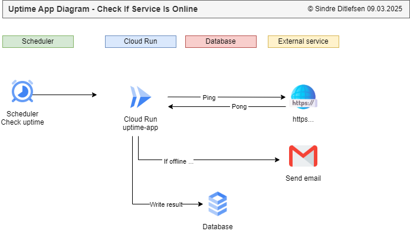

# 🗒️ Uptime App

[🏠 Home](../)
&nbsp; &nbsp;
[⬅ 🎯 Projects Included](../#-4-projects-included)

Tracks and manages other applications uptime.

| Category     | Details                                  |          
|--------------|------------------------------------------|
| Tech         | Next.js                                  |
| Runs on      | Cloud Run                                |
| GCP Services | PostgreSQL, Email, Secrets and Scheduler |


Table of contents:
1. [📖 Learning Objectives for Uptime App](#-1-learning-objectives-for-uptime-app)
2. [✨ Lessons Overview for Uptime App](#-2-lessons-overview-for-uptime-app)
3. [📸 Diagram and Screenshots from Uptime App](#-3-diagram-and-screenshots-from-uptime-app)
4. [⚛️ Creating Uptime App in Next.js](#%EF%B8%8F-4-creating-uptime-app-in-nextjs)
5. [🛡️ Implementing DevSecOps: Snyk and ZAP Scan](#%EF%B8%8F-5-implementing-devsecops-snyk-and-zap-scan)
6. [🌐 Setting up Google Cloud Infrastructure for Uptime App](#-6-setting-up-google-cloud-infrastructure-for-uptime-app)
7. [🐘 Connecting to PostgresSQL with pgAdmin](#-7-connecting-to-postgressql-with-pgadmin)
8. [🔗 Connecting to PostgresSQL with Next](#-8-connecting-to-postgressql-with-next)
9. [🧹 Webdesign](#-9-webdesign)
10. [📦 Migrations](#-10-migrations)
11. [🔑 Next Auth](#-11-log-in)
12. [📊 Dashboard](#-12-dashboard)
13. [➕ Add HTTP](#-13-add-http)
14. [✏️ Edit HTTP](#%EF%B8%8F-14-edit-http)
15. [❌ Delete HTTP](#-15-delete-http)
16. [📡 Endpoint to receive scheduler for HTTP](#-16-endpoint-to-receive-scheduler-for-http)
17. [📈 Statistics on Dashboard](#-17-statistics-on-dashboard)
18. [👥 List Users](#-18-list-users)
19. [➕ Add Users](#-19-add-users)
20. [✏️ Edit Users](#%EF%B8%8F-20-edit-users)
21. [❌ Delete Users](#-21-delete-users)
22. [🖥️ Running the Uptime App Locally](#%EF%B8%8F-22-running-the-uptime-app-locally)
23. [☁️ Running the Uptime App on Google Cloud Run](#%EF%B8%8F-23-running-the-uptime-app-on-google-cloud-run)
24. [📜 License](#-24-license)

---

## 📖 1 Learning Objectives for Uptime App

After this module you will be able to:

* Build a Full-Stack App with Next.js – Develop a complete uptime monitoring application with a responsive dashboard.

* Work with PostgreSQL & API Integration – Connect to databases, manage migrations, and integrate external APIs.

* Implement User Authentication & Role Management – Secure user access with sign-up, login, and role-based controls.

* Deploy & Scale on Google Cloud – Deploy the app using Google Cloud Run for scalability and reliability.


---

## ✨ 2 Lessons Overview for Uptime App


1. **Introduction**

2. **Creating Next.js application**<br>
- Implementing core functionality for Next.js application
- Activity/Reflection

3. **Implementing DevSecOps: Snyk and ZAP Scan**<br>
- Learn how to integrate security tools like Snyk for dependency scanning and ZAP for vulnerability testing.
- Activity/Reflection:

4. **Setting up Google Cloud Infrastructure for Uptime App**<br>
- Configure Google Cloud resources needed for deployment, including Cloud Run and database.
- Activity/Reflection:

5. **Connecting to PostgresSQL with pgAdmin**<br>
- Install and configure pgAdmin to manage PostgreSQL databases efficiently.
- Activity/Reflection:

6. **Connecting to PostgresSQL with Next**<br>
- Implement a PostgreSQL connection within a Next.js application.
- Activity/Reflection:

7. Webdesign

8. **Migrations**<br>
- Learn how to handle database migrations for schema evolution using tools like Prisma or Sequelize.
- Activity/Reflection:

9. **Next Auth**<br>
- Implement user login with authentication and validation.
- Activity/Reflection:

10. **Dashboard**<br>
- Design and develop a user-friendly dashboard for monitoring uptime data.
- Activity/Reflection:

11. **Add HTTP**<br>
- Implement functionality to add HTTP endpoints for monitoring.
- Activity/Reflection:

12. **Edit HTTP**<br>
- Enable users to modify existing HTTP monitoring settings.
- Activity/Reflection:

13. **Delete HTTP**<br>
- Implement the ability to remove HTTP endpoints from monitoring.
- Activity/Reflection:

14. **Endpoint to receive scheduler for HTTP**<br>
- Set up an API endpoint to handle scheduled monitoring tasks.
- Activity/Reflection:

15. **Statistics on Dashboard**<br>
- Display analytics and insights related to monitored uptime data.
- Activity/Reflection:

16. **List Users**<br>
- Develop an interface to display all registered users.
- Activity/Reflection:

17. **Add User**<br>
- Implement a feature to add new users to the system.
- Activity/Reflection:

18. **Edit User**<br>
- Allow modification of user details and permissions.
- Activity/Reflection:

19. *Delete User**<br>
- Implement functionality to remove users from the system.
- Activity/Reflection:

20. **Congratulations and Learning Tip**<br>
- Learning tip: Set small, consistent learning goals rather than overwhelming yourself with too much at once. Progress builds over time.
- Reflection: What is one small habit you can develop to enhance your skills every day?

21. **Quiz**


---


## 📸 3 Diagram and Screenshots from Uptime App

**Manage Service Diagram**
A user can add, edit and delete watchers<br>
 


**Check if services are online diagram**
A scheduler will start the application to check if services are up<br>
 

---

## ⚛️ 4 Creating Uptime App in Next.js


**1. Create new repository in Github**

* Name: **uptime-nextjs**

**2. Create new application**

Open CMD/Terminal and write:

```
mkdir next
cd next
npx create-next-app@latest
```

* What is your project name: **uptime**
* Would you like to use TypeScript: **Yes**
* Would you like to use ESLint: **Yes**
* Would you like to use Tailwind CSS: **No**
* Would you like yor code inside a `src/` directory: **No**
* Would you like to use App Router? (recommended): **Yes**
* Would you like to use Turbopack for `next dev`?: **No**
* Would you like to customize the import alias (`@/*` by default)?: **No**

**3. Initialize files to Github**

File > Terminal:

```
echo "# test" >> README.md
git init
git add README.md
git commit -m "first commit"
git branch -M main
git remote add origin https://github.com/YOUR_GITHUB_USERNAME/YOUR_GITHUB_REPOSITORY_NAME.git
git push -u origin main
```

**4. Start the application**

```
npm install
npm run dev
```

Open [http://localhost:3000](http://localhost:3000) with your browser to see the application.


## 🛡️ 5 Implementing DevSecOps: Snyk and ZAP Scan

### Snyk

https://snyk.io

### ZAP Scan

.github/workflows/sec-node.yml<br>
```
name: Security for Next.js - DAST for web with OASP ZAP

on: [push]

jobs:
  dast_scan:
    runs-on: ubuntu-latest
    name: DAST (Dynamic Application Security Testing) with OASP ZAP
    steps:
      - name: ZAP Scan
        uses: zaproxy/action-full-scan@v0.10.0
        with:
          target: 'https://your-project-name-t6qfqcqcha-lz.a.run.app/'
```

---


## 🌐 6 Setting up Google Cloud Infrastructure for Uptime App

### Create PostgresSQL database

https://console.cloud.google.com > SQL > [Create Instance]<br>

* Choose your database engine: **PosgtreSQL**
* Choose a Cloud SQL edition: Enterprise
* Edition preset: Sandbox

**Instance info**<br>
* Database version: Latest
* Instance ID: cloud-postgres-prod
* Password: random password (https://my.norton.com/extspa/passwordmanager?path=pwd-gen)


**Choose region and zonal availability**<br>
* Region: europe-north1 (Finland)
* Zonal Availability: Single zone

**Machine configuration**<br>
* Machine shapes: Shared core
* 1 vCPI, 0.614 GB

**Storage**<br>
* Storage type: HDD
* Storage capacity: 10 GB

**Data protection**<br>
* Automated daily backups: Uncheck

**Labels**<br>
* owner = YOUR_NAME


### Deploy application on Google Cloud Run

GCP > Cloud Run > Deploy Container > Service  > Github > Set up Cloud Build

* Repository: uptime-next-gcp
* Build configuration: ^main$
* Build type: Go, Node.js, Python, Java, .NET Core, Ruby or PHP via Google Cloud's buildpacks 

Set RAM 

Cloud SQL connections: Set connection to PostgreSQL

---

## 🐘 7 Connecting to PostgresSQL with pgAdmin

## 7.1 Create local database

pgAdmin > Servers > PostgreSQL X > Databases > [Right click] > Create: Database

* Database: cloud-dev

## 7.2 Connect to production database

**Add your network**<br>
Google Cloud Console > SQL > Connections > Networking > Authorised networks > [Add a network]

* Name: YOUR_NAME, YOUR_ADDRESS, YOUR_ISP (Example John Doe, 4567 Oak Avenue, Los Angeles, CA 90012, Spectrum Internet)
* Value: IP from https://whatismyipaddress.com/

**Download Certificates:**<br>

Google Cloud Console > SQL > cloud-prod > Connections > Security<br>

SSL Mode<br>
* Allow only SSL connections<br>

Manage client certificates
* Create Client Certificate
  * Client Certificate Name: YOUR_NAME - YOUR_COMPUTER_NAME (Example John Doe, Lenovo Ideapad Slim 3)
* Download the 3 generated files (client-key.pem, client-cert.pem and server-ca.pem)
* Save files to the pgadmin folder
  * Folder in unix systems: $HOME/.pgadmin/DB_NAME
    * `chmod 600 $HOME/.pgadmin/DB_NAME/*.pem`
  * Folder in Windows: C:\Program Files\PostgreSQL\DB_NAME


**Connect:**<br>

* pgAdmin > Servers > [Right click] > Register: Server
* Name: Retrieve from Google Cloud Console
* Port: 5432
* Username: postgres
* PARAMETERS
  * Add 3 new parameters and link them to the respective files:
    - Client certificate key > client-key.pem
    - Client certificate > client-cert.pem 
    - Root certificate > server-ca.pem


---

## 🔗 8 Connecting to PostgresSQL with Next

### Connect from local machine

* Install PostgresSQL for Node.js:
`npm install pg` and
`npm install --save-dev @types/pg`

* Copy the file `env.example` to `.env.development`.
* Create file `lib/db.ts`


### Connect from Cloud Run

Open Cloud Run > Edit.

Set the environment variables:

* Database
 * DB_HOST=/cloudsql/GOOGLE_CLOUD_PROJECT_NAME:europe-north1:cloud-postgres-prod
 * DB_USER=postgres
 * DB_PASS=YOUR_PASSWORD
 * DB_NAME=postgres
 * DB_PORT=5432

* Next.auth:
 * NEXTAUTH_SECRET=RandomStringThatIsVeryLong2022 from https://auth-secret-gen.vercel.app/
 * NEXTAUTH_URL=https://uptime-644994207224.europe-north1.run.app (Change to your URL)


---

## 🧹 9 Webdesign


Remove all unnecessary:
* Copy in CSS: app/globals.css
* Copy in Layout: app/layout.tsx
* Use latest in package.json


---

## 📦 10 Migrations

* Copy migrations/monitors/monitors_index_001.sql
* Copy migrations/users/users_index_001.sql
* Create file app/lib/db.ts
* Create file app/(public)/public-migrations/api-run-migrations/route.ts
* Create file app/(public)/public-migrations/page.tsx
* Visit http://localhost:3000/public-migrations

---

## 🔑 11 Next Auth

OAuth
* Sign up for two Oauth on https://github.com/settings/developers - one for development and one for production 

Installations
* Install next-auth: `npm install next-auth`

API
* Create api `app\api\auth\[...nextauth]\route.ts`

Lib
* Create lib `app/lib/auth.ts`
* Create lib `app/lib/useLoginRequiredClient.ts`

Types
* Create lib `app/types/next-auth.d.ts`

Sign In
* Create page `app/(public)/sign-in/page.tsx`
* Add `app/(public)/sign-in/components/AuthButton.tsx`

users_index_001.sql:
* The admin (first user) that wants to sign in should be added to users_index_001.sql.


---


## 📊 12 Dashboard

---


## ➕ 13 Add HTTP

---


## ✏️ 14 Edit HTTP

---


## ❌ 15 Delete HTTP

---


## 📡 16 Endpoint to receive scheduler for HTTP


---


## 📈 17 Statistics on Dashboard

---


## 👥 18 List Users

---


## ➕ 19 Add Users

---


## ✏️ 20 Edit Users

---


## ❌ 21 Delete Users
---


## 🖥️ 22 Running the Uptime App Locally

---


## ☁️ 23 Running the Uptime App on Google Cloud Run


## 📜 24 License


This project is licensed under the
[Creative Commons Attribution-NonCommercial-NoDerivatives 4.0 International License](https://creativecommons.org/licenses/by-nc-nd/4.0/).

**⚠️ Warning: Educational Material Only**

This repository contains projects and resources created for educational purposes as part of the Udemy course 
`Python, Next.js, PostgreSQL and DevSecOps on Google Cloud Platform with Projects from Real Industry`.

**This code is not intended for production use** and is provided **"as is"**. 
Use it at your own risk. No warranties or guarantees are provided, either express or implied. 

This material is **for students** enrolled in the course and is not meant to be used as part of any commercial product or service. 
Do not use the code as part of any production environment without thorough testing, modification, and security review.

