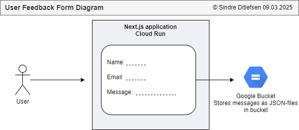

# 📝 User Feedback Form 

[🏠 Home](../)
&nbsp; &nbsp;
[⬅ 🎯 Projects Included](../#-4-projects-included)

The user feedback form is a Next.js application that runs on Google Cloud Run.
It allows users to give their feedback and the results are stored in Google Cloud Bucket.

| Category     | Details   |          
|--------------|-----------|
| Tech         | Next.js   |
| Runs on      | Cloud Run |
| GCP Services | Buckets   |


#  

Table of contents:
1. [📖 Learning objectives](#-1-learning-objectives)
2. [✨ Lessons Overview](#-2-lessons-overview)
3. [🚀 Getting Started with User Feedback Form](#-3-getting-started-with-user-feedback-form)
4. [☁️ Running User Feedback Form on Google Cloud Run](#%EF%B8%8F-4-running-user-feedback-form-on-google-cloud-run)
5. [📦 Next.js Utils and Functions](#-5-nextjs-utils-and-functions)
6. [🖥️ Running the User Feedback Form Locally](#%EF%B8%8F-6-running-user-feedback-form-locally)
7. [🛡️ Add Application to Snyk](#%EF%B8%8F-7-add-application-to-snyk)
8. [📜 License](#-8-license)

---

## 📖 1 Learning objectives

By the end of this module, you will:<br>
- Understand how to **create a Next.js application** from scratch.
- Learn to **deploy** a Next.js app on **Google Cloud Run** as a Docker container.
- Set up **Google Cloud infrastructure** including buckets and service accounts.
- Integrate **DevSecOps** tools like **Snyk** for security.
- Build a user feedback form with **form handling, validation, and storage**.
- Implement **email notifications** for submitted feedback.
- Run the application locally and **troubleshoot common issues**.

---

## ✨ 2 Lessons Overview


1. **Introduction**

2. **Creating app**<br>
- Create a new application locally and push it to Github.<br>
- Activity: Follow a checklist to create and push your application to GitHub. Afterward, note any challenges and how you solved them.<br>

3. **Setup GCP Infrastructure** <br>
- Setup a GCP project, service account, bucket and the Cloud Run application.<br>
- Activity: Draw a simple diagram showing how these components interact.

4. **DevSecOps Integration** <br>
- Integrate Github repository with Snyk. What is the benefits and drawbacks of using 'latest'?<br>
- Reflection: What are the benefits and drawbacks of using 'latest' in dependencies?

5. **Creating the Form**<br>
- First, create the form, then add constants for the form, feedback, handle input changes, and submit.<br>
- Activity: Implement email validation for the form. Why is input validation important for security?

6. **Styling the form**<br>
- Add CSS to the form.<br>
- Activity: Add icons to feedback boxes and reflect on how they improve user experience.

7. **Bucket Integration**<br>
- Build the API that handles form submission with bucket integration.<br>
- Reflection: What are some security risks when integrating with cloud storage, and how can they be mitigated?

8. **Email Integration**<br>
- Add email notification when someone submits the form.<br>
- Activity: Implement email notifications and consider how to prevent spam abuse.

9. **Security Command Center**<br>
- Demo securing our Google Cloud Environment.<br>
- Activity: Identify one security risk in your GCP setup using Security Command Center and find a way to mitigate it.

10. **Congratulations and Learning Tip**<br>
-  Reflection: How do spam bots exploit web forms, and what steps can be taken to prevent them?

11. **Quiz**

---


## 🚀 3 Getting Started with User Feedback Form

**1. Create new repository in Github**

https://github.com/new

**2. Create new application**

Open CMD/Terminal and write:

```
mkdir next
cd next
npx create-next-app@latest
```

* What is your project name: **user-feedback-form**
* Would you like to use TypeScript: **Yes**
* Would you like to use ESLint: **Yes**
* Would you like to use Tailwind CSS: **No**
* Would you like yor code inside a `src/` directory: **No**
* Would you like to use App Router? (recommended): **Yes**
* Would you like to use Turbopack for `next dev`?: **No**
* Would you like to customize the import alias (`@/*` by default)?: **No**


**3. Open project in VSCode**

You may want to edit the workbench label format:<br>
File > Preferences > Settings > <br>
```"workbench.editor.labelFormat": "short"```

**4. Initialize files to Github**

File > Terminal:

```
echo "# test" >> README.md
git init
git add README.md
git commit -m "first commit"
git branch -M main
git remote add origin https://github.com/YOUR_GITHUB_USERNAME/YOUR_GITHUB_REPOSITORY_NAME.git
git push -u origin main
```

**5. Start the application**

```
npm install
npm run dev
```

Open [http://localhost:3000](http://localhost:3000) with your browser to see the application.

---


## ☁️ 4 Running User Feedback Form on Google Cloud Run

### 4.1 Create a Google Cloud Console Project (one time setup)

https://console.cloud.google.com/ > https://console.cloud.google.com/projectcreate

* Name: applications-dev


### 4.2 Create service account to lunch applications (one time setup)

IAM > Service accounts > + Create Service Account

* Name: **Cloud Run, Cloud Run Functions and Scheduler Service Account**
* Description: **This is used for Cloud Run, Cloud Run Functions and Scheduler Service. It can read secrets and invoke Run and Functions**

Permissions/Assign Roles:
* Cloud Scheduler Service Agent
* Service Account Admin


### 4.3 Create bucket

**Create Bucket:**

Buckets > [Create]

Get started:
* Name: **user-feedback-form-bucket**
* Labels: owner: YOUR_NAME

Location type:
* Region - europe-north1

[Create]

**Change the Lifecycle:**

Lifecycle > Add a rule

Action:
* Delete object

Select object conditions:
* Age 365 days

### 4.4 Make sure that the application has a Docker file

Create a file `Dockerfile` in the project with the following contents:

```
FROM node:alpine

WORKDIR /app

COPY package.json package-lock.json ./

RUN npm install

COPY . .

RUN npm run build

EXPOSE 3000

CMD ["npm", "start"]
```

### 4.5 Deploy on Cloud Run

Cloud Run > Deploy Container > Service

* Github - Continuously deploy from a repository (source or function)

Configure:
* Service name: user-feedback-form
* Region: europe-north1 (Finland)
* Authentication: Allow unauthenticated invocations
* Billing: Request based

Service Scaling
* Auto-scaling: Checked
* Minimum number of instances: 0

Containers > Resources:
* Memory: 128 MB

Containers > Revision scaling:
* Minimum number of instances: 0
* Maximum number of instances: 1

Containers > Security:
* Service account: Cloud Run, Cloud Run Functions and Scheduler Service Account

---

## 📦 5 Next.js Utils and Functions

Send email: 
[https://github.com/sendgrid/sendgrid-nodejs/tree/main/packages/mail](https://github.com/sendgrid/sendgrid-nodejs/tree/main/packages/mail)


---

## 🖥️ 6 Running the Finished User Feedback Form Locally

**1. Clone the repository**

**2. Open the directory `user-feedback-form` in VSCode**

**3. Start the application**

```
npm install
npm run dev
```

Open [http://localhost:3000](http://localhost:3000) with your browser to see the application.


---


## 🛡️ 7 Add Application to Snyk


---

## 📜 8 License


This project is licensed under the
[Creative Commons Attribution-NonCommercial-NoDerivatives 4.0 International License](https://creativecommons.org/licenses/by-nc-nd/4.0/).

**⚠️ Warning: Educational Material Only**

This repository contains projects and resources created for educational purposes as part of the Udemy course 
`Python, Next.js, PostgreSQL and DevSecOps on Google Cloud Platform with Projects from Real Industry`.

**This code is not intended for production use** and is provided **"as is"**. 
Use it at your own risk. No warranties or guarantees are provided, either express or implied. 

This material is **for students** enrolled in the course and is not meant to be used as part of any commercial product or service. 
Do not use the code as part of any production environment without thorough testing, modification, and security review.

