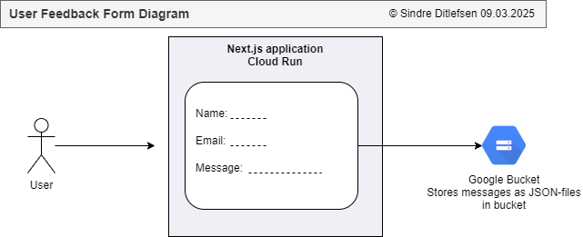

# 📝 User Feedback Form 

[🏠 Home](../../)
&nbsp; &nbsp;
[⬅ 🎯 Projects Included](../#-4-projects-included)

The user feedback form is a Next.js application that runs on Google Cloud Run.
It allows users to give their feedback and the results are stored in Google Cloud Bucket.

| Category      | Details   |          
|---------------|-----------|
| Tech          | Next.js   |
| Runs on       | Cloud Run |
| GCP Serviuces | Buckets   |


#  

Table of contents:
1. [🚀 Getting Started with User Feedback Form](#-1-getting-started-with-user-feedback-form)
2. [📦 Next.js Utils and Functions](#-2-nextjs-utils-and-functions)
3. [🖥️ Running the Finished User Feedback Form Locally](#%EF%B8%8F-3-running-the-finished-user-feedback-form-locally)
4. [☁️ Running the Finished User Feedback Form on Google Cloud Run](#%EF%B8%8F-4-running-the-finished-user-feedback-form-on-google-cloud-run)
5. [📜 License](#-5-license)

---

## 🚀 1 Getting Started with User Feedback Form

1. Create new application

Open CMD/Terminal and write:

```
mkdir next
cd next
npx create-next-app@latest
```

* What is your project name: **user-feedback-form**
* Would you like to use TypeScript: **Yes**
* Would you like to use ESLint: **Yes**
* Would you like to use Tailwind CSS: **No**
* Would you like yor code inside a `src/` directory: **No**
* Would you like to use App Router? (recommended): **Yes**
* Would you like to use Turbopack for `next dev`?: **No**
* Would you like to customize the import alias (`@/*` by default)?: **No**


2. Open project in VSCode

You may want to edit the workbench label format:<br>
File > Preferences > Settings > <br>
```"workbench.editor.labelFormat": "short"```


3. Start the application

```
npm install
npm run dev
```

Open [http://localhost:3000](http://localhost:3000) with your browser to see the application.

---

## 📦 2 Next.js Utils and Functions

---

## 🖥️ 3 Running the Finished User Feedback Form Locally

1. Clone the repository

2. Open the directory `user-feedback-form` in VSCode

3. Start the application

```
npm install
npm run dev
```

Open [http://localhost:3000](http://localhost:3000) with your browser to see the application.


---

## ☁️ 4 Running the Finished User Feedback Form on Google Cloud Run

### 1. Create service account `Cloud Scheduler Service Account for Cloud Run and Functions` (one time setup)

IAM > Service accounts > + Create Service Account

* Name: **Cloud Scheduler Service Account for Cloud Run and Functions**
* Description: **This is used for Google Cloud Scheduler. It can read secrets and invoke functions**

Permissions/Assign Roles:
* Cloud Scheduler Service Agent
* Service Account Admin


### 2. Deploy on Cloud Run

Cloud Run > Deploy Container > Service

* Type: Github

Configure:
* Service name: user-feedback-form-diagram.drawio
* Region: europe-north1 (Finland)
* Authentication: Allow unauthenticated invocations
* Billing: Request based

Service Scaling
* Auto-scaling: Checked
* Minimum number of instances: 0

Containers > Resources:
* Memory: 128 GB

Containers > Revision scaling:
* Minimum number of instances: 0
* Maximum number of instances: 1

Containers > Security:
* Service account: Cloud Scheduler Service Account for Cloud Run and Functions


---

## 📜 5 License


This project is licensed under the
[Creative Commons Attribution-NonCommercial-NoDerivatives 4.0 International License](https://creativecommons.org/licenses/by-nc-nd/4.0/).

**⚠️ Warning: Educational Material Only**

This repository contains projects and resources created for educational purposes as part of the Udemy course 
`Python, Next.js, PostgreSQL and DevSecOps on Google Cloud Platform with Projects from Real Industry`.

**This code is not intended for production use** and is provided **"as is"**. 
Use it at your own risk. No warranties or guarantees are provided, either express or implied. 

This material is **for students** enrolled in the course and is not meant to be used as part of any commercial product or service. 
Do not use the code as part of any production environment without thorough testing, modification, and security review.

