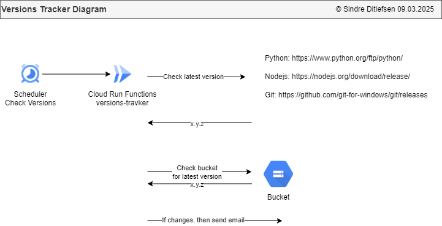
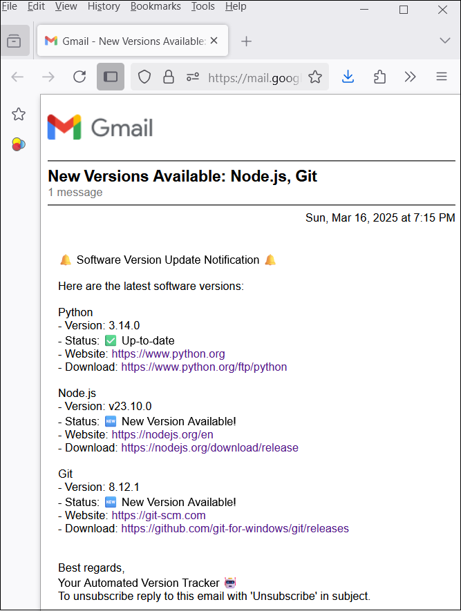

# 🔄 Versions Tracker

[🏠 Home](../)
&nbsp; &nbsp;
[⬅ 🎯 Projects Included](../#-4-projects-included)

Fetches API data and posts updates to Slack.

| Category     | Details                               |          
|--------------|---------------------------------------|
| Tech         | Python                                |
| Runs on      | Cloud Run Functions                   |
| GCP Services | Buckets, Secrets, Scheduler and Email |


Table of contents:
1. [📖 Learning Objectives for Versions Tracker](#-1-learning-objectives-for-versions-tracker)
2. [✨ Lessons Overview for Versions Tracker](#-2-lessons-overview-for-versions-tracker)
3. [📸 Diagram and Screenshots from Versions Tracker](#-3-diagram-and-screenshots-from-version-tracker)
4. [🚀 Create Python Application for Versions Tracker](#-4-create-python-application-for-versions-tracker)
5. [☁️ Configure Google Cloud Infrastructure](#%EF%B8%8F-5-configure-google-cloud-infrastructure)
6. [⚡ Configure CI/CD with GitHub Actions](#-6-configure-cicd-with-github-actions)
7. [🕒 Setup a Google Cloud Scheduler](#-7-setup-a-google-cloud-scheduler)
8. [💻 Implementing Check for New Versions](#-8-implementing-check-for-new-versions)
9. [✉️ Implementing Email Message if There Are New Version](#%EF%B8%8F-9-implementing-email-message-if-there-are-new-version)
10. [🖥️ Running the Finished Version Tracker Locally](#%EF%B8%8F-10-running-the-finished-versions-tracker-locally)
11. [☁️ Running the Finished Version Tracker on Google Cloud Run Functions](#%EF%B8%8F-11-running-the-finished-versions-tracker-on-google-cloud-run-functions)
12. [📜 License](#-12-license)

---

## 📖 1 Learning Objectives for Version Tracker

* Create a **Python application** with **Google Cloud Run Functions**.
* Set up **Google Cloud services** like **Buckets**, **Email**, **Secrets** and **Scheduler**.
* Automate deployment using **GitHub Actions** (CI/CD - Continuous Integration and Continuous Deployment/Delivery).
* Use **Google Cloud Scheduler** to run tasks periodically.
* Send **email notifications** for new versions.

---

## ✨ 2 Lessons Overview for Version Trackern

1. **Introduction**

2. **Create Python application**<br>
- Create a new application locally and push it to Github.<br>
- Activity: Import the project into Snyk. Are there any errors?

3. **Configure Google Cloud Infrastructure** <br>
- Setup a GCP project, service account, bucket and the Cloud Run Functions application.<br>
- Activity/Reflection: What is the difference between Cloud Run and Cloud Run Functions?

4. **Configure CI/CD with Github Actions**<br>
- Create a service account, a Pool and Github Actions file
- Activity/Reflection: How does CI/CD benefit your project? 

5. **Setup a scheduler**<br>
- Create a new Google Cloud Scheduler that checks for new versions every month
- Reflection: How often should the scheduler run?

6. **Implementing Check for New Versions**<br>
- Program the check for new versions
- Activity/Reflection: What other services do you use?

7. **Implementing Email Message if There Are New Version**<br>
- If there are any new versions we want an email
- Activity/Reflection: Is there a better way than email?

8. **Congratulations and Learning Tip**<br>
- Learning tip: As you work through each step, don’t wait until the end to test your application. 
- Reflection: What Did You Learn?

9. **Quiz**

---

## 📸 3 Diagram and Screenshots from Version Tracker

**Version Tracker Diagram**<br>
This diagram shows the structure and flow of the Version Tracker, outlining its components and how user data is processed.<br>
 

**Email With New Versions**<br>
If there are any new versions they will be emailed to the recipients<br>
 


---

## 🚀 4 Create Python Application for Version Tracker

**1. Create new application in Github**

**2. Open application in PyCharm**

Pycharm > File > Close Project<br><br>

Pycharm > Get from VCS<br><br>


**3. Add requirements.txt**

```
functions-framework         # Added by YOUR_NAME. Framework for running Google Cloud Functions locally
google-cloud-storage        # Added by YOUR_NAME. Interact with Google Cloud Storage for file operations
google-cloud-secret-manager # Added by YOUR_NAME. Read and write secrets to Google Cloud
flask                       # Added by YOUR_NAME. To run the application locally
beautifulsoup4              # Added by YOUR_NAME. Library that makes it easy to scrape information from web pages
```

**4. Create main.py**

```python


import flask
import functions_framework

@functions_framework.http
def main(request: flask.wrappers.Request):
    """HTTP Cloud Function"""
    log_headline: str = f"main()"
    print(f"{log_headline} · Init")


if __name__ == '__main__':
    print("versions-tracker local run")

    app = flask.Flask(__name__)  # Create a Flask app instance
    request = flask.request
    main(request)
```

**5. Install requirements**

PyCharm > Terminal:

`pip install -r requirements.txt`

**6. Run application**<br>
In PyCharm go to main.py and click `Run`


---

## ☁️ 5 Configure Google Cloud Infrastructure


1. Create bucket<br>
https://console.cloud.google.com > Buckets > [Create]<br>

* Name: versions-tracker-bucket
* Labels: owner: YOUR_NAME

Location type:
* Region - europe-north1

[Create]


---

## ⚡ 6 Configure CI/CD with GitHub Actions

Manually we can deploy a Python script as a Google Cloud Run Function using this command:

```commandline
gcloud auth login

gcloud functions deploy versions-tracker --project=YOUR_PROJECT --gen2 --runtime=python312 --region=europe-north1 --source=. --entry-point=main --trigger-http --timeout=540 --max-instances=1 --verbosity=info --memory=512MB
```

1. Create IAM Service account for Github Actions Auth

IAM > Service accounts > + Create Service Account

* Name: **GitHub Actions Auth**
* Description: **Logs into GCP from Google Cloud**

Permissions/Assign Roles:
* Service Account User

2. Create .github workflow

Create a new file:<br>
`.github/workflows/google_functions_deployment.yaml`

```commandline
# Service accounts are located here:
# https://console.cloud.google.com/iam-admin/serviceaccounts
#
# There are two service accounts:
# - Name: Github Actions Auth
#   ID: github-actions-auth@GOOGLE_CLOUD_PROJECT_ID.iam.gserviceaccount.com
#   Description: Logs into GCP from Google Cloud
#   Permissions: Service Account User
#
# - Name: Cloud Scheduler Service Agent
#   ID: cloud-run-cloud-run-functions@GOOGLE_CLOUD_PROJECT_ID.iam.gserviceaccount.com
#   Description: Cloud Run, Cloud Run Functions and Scheduler Service Account
#   Permissions: This is used for Cloud Run, Cloud Run Functions and Scheduler Service. It can read secrets and invoke Run and Functions.


name: CD

# Controls when the workflow will run
on:
  # Triggers the workflow on push or pull request events but only for the main branch
  push:
    branches: [main]

  # Allows you to run this workflow manually from the Actions tab
  workflow_dispatch:

# A workflow run is made up of one or more jobs that can run sequentially or in parallel
jobs:
  deploy:
    runs-on: ubuntu-latest
    permissions:
      contents: "read"
      id-token: "write"
    steps:
      - name: checkout repo
        uses: actions/checkout@v3
      - id: "auth"
        name: "Authenticate to Google Cloud"
        uses: "google-github-actions/auth@v1"
        with:
          workload_identity_provider: "projects/GOOGLE_CLOUD_PROJECT_ID/locations/global/workloadIdentityPools/gh-pool/providers/gh-provider"
          service_account: "github-actions-auth@GOOGLE_CLOUD_PROJECT_ID.iam.gserviceaccount.com"
      - id: "deploy"
        uses: "google-github-actions/deploy-cloud-functions@v1"
        with:
          name: "limacharlie-surveillance"
          runtime: "python312"
          region: "europe-north1"
          entry_point: "main"
          timeout: 540
          service_account_email: cloud-run-cloud-run-functions@appspot.gserviceaccount.com
          ingress_settings: ALLOW_ALL
          max_instances: 1
```

3. Make connection between your repo and Google Cloud Functions

3.1 Open Powershell and write in the following:

```
$GITHUB_REPO="GITHUB_USER:NAME/GITHUB_REPO_NAME"
$PROJECT_ID="GOOGLE_CLOUD_PROJECT_ID"
$SERVICE_ACCOUNT="github-actions-auth"
$WORKLOAD_IDENTITY_POOL="gh-pool"
$WORKLOAD_IDENTITY_PROVIDER="gh-provider"
```

3.2 Set project ID<br>
```gcloud config set project $PROJECT_ID```

3.3 Get ID:<br>
```gcloud iam workload-identity-pools describe $WORKLOAD_IDENTITY_POOL --location="global" --format="value(name)"```

--> projects/XXXX/locations/global/workloadIdentityPools/gh-pool

```$WORKLOAD_IDENTITY_POOL_ID="projects/XXXX/locations/global/workloadIdentityPools/gh-pool"```

3.4 Connect repository:<br>
```gcloud iam service-accounts add-iam-policy-binding $SERVICE_ACCOUNT@$PROJECT_ID.iam.gserviceaccount.com --role="roles/iam.workloadIdentityUser" --member="principalSet://iam.googleapis.com/${WORKLOAD_IDENTITY_POOL_ID}/attribute.repository/${GITHUB_REPO}"```


---


## 🕒 7 Setup a Google Cloud Scheduler


https://console.cloud.google.com > Cloud Scheduler > [Create Job]<br>

**Define the schedule**<br>
* Name: versions-tracker-scheduler
* Region: europe-west1 (Belgium)
* Descriptions: Triggers the Version Tracker function to check if there are any new versions.
* Frequency: 0 9 1 */3 *
* Timezone: Central European Standard Time (CET)

**Configure the execution**<br>
* Target Type: HTTP
* URL: URL_TO_FUNCTION
* HTTP method: GET
* Auth header: Add OAuth Token
* Service account: Cloud Run, Cloud Run Functions and Scheduler Service Account
* Scope: URL_TO_FUNCTION

[Create]


---

## 💻 8 Implementing Check for New Versions


1. Implement applications_list.json

2. Implement get_version_list.py

3. Implement get_version_github.py 

4. Implement loop in main


---

## ✉️ 9 Implementing Email Message if There Are New Version

1. Create a secret `versions-tracker-services`:

Google Cloud > Secret manager > New

* Name: **versions-tracker-services**
* Secret value: ```{
"gmail_sender_email": "YOU@gmail.com",
"gmail_app_password": "APP_PASSWORD",
"recipient_email_addresses":   "YOU@gmail.com"
}```
* Location(s): **europe-north1**
* Labels: 
  * owner: YOUR_NAME
  * app: versions-tracker

2. Implement send_gmail_app_pass.py

3. Implement send_email.py <br>
Change the project ID.

4. On new version send email


---

## 🖥️ 10 Running the Finished Version Tracker Locally

**1. Clone the repository**

**2. Open the directory `versions-tracker` in PyCharm**


**3. Install requirements**

PyCharm > Terminal:

`pip install -r requirements.txt`

**4. Start the application**<br>
In PyCharm go to main.py and click `Run`


---

## ☁️ 11 Running the Finished Versions Tracker on Google Cloud Run Functions

### 1. Create service account `Cloud Scheduler Service Account for Cloud Run and Functions` (one time setup)

IAM > Service accounts > + Create Service Account

* Name: **Cloud Scheduler Service Account for Cloud Run and Functions**
* Description: **This is used for Google Cloud Scheduler. It can read secrets and invoke functions**

Permissions/Assign Roles:
* Cloud Scheduler Service Agent
* Service Account Admin


### 2. Create bucket

**Create Bucket:**

Buckets > [Create]

Get started:
* Name: **versions-tracker-bucket**
* Labels: owner: YOUR_NAME

Location type:
* Region - europe-north1

[Create]


### 3. Deploy on Cloud Run Functions

```commandline
gcloud auth login
gcloud functions deploy versions-tracker --gen2 --runtime=python312 --region=europe-north1 --source=. --entry-point=main --trigger-http --timeout=540 --verbosity=info --project=applications-dev --memory=512MB
```


---

## 📜 12 License


This project is licensed under the
[Creative Commons Attribution-NonCommercial-NoDerivatives 4.0 International License](https://creativecommons.org/licenses/by-nc-nd/4.0/).

**⚠️ Warning: Educational Material Only**

This repository contains projects and resources created for educational purposes as part of the Udemy course 
`Python, Next.js, PostgreSQL and DevSecOps on Google Cloud Platform with Projects from Real Industry`.

**This code is not intended for production use** and is provided **"as is"**. 
Use it at your own risk. No warranties or guarantees are provided, either express or implied. 

This material is **for students** enrolled in the course and is not meant to be used as part of any commercial product or service. 
Do not use the code as part of any production environment without thorough testing, modification, and security review.

