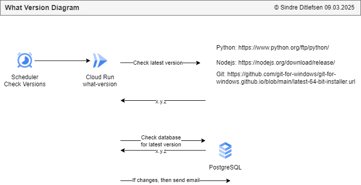

# 🔄 User Feedback Form 

[🏠 Home](../)
&nbsp; &nbsp;
[⬅ 🎯 Projects Included](../#-4-projects-included)

Fetches API data and posts updates to Slack.

| Category     | Details                               |          
|--------------|---------------------------------------|
| Tech         | Python                                |
| Runs on      | Cloud Run Functions                   |
| GCP Services | Buckets, Email, Secrets and Scheduler |


#  

Table of contents:
1. [🚀 Getting Started with What Version](#-1-getting-started-with-user-feedback-form)
2. [📦 Python Utils and Functions](#-2-nextjs-utils-and-functions)
3. [🖥️ Running the Finished What Version Locally](#%EF%B8%8F-3-running-the-finished-user-feedback-form-locally)
4. [☁️ Running the Finished What Version on Google Cloud Run Functions](#%EF%B8%8F-4-running-the-finished-user-feedback-form-on-google-cloud-run)
5. [📜 License](#-5-license)

---

## 🚀 1 Getting Started with What Version

**1. Create new application in Github**

**2. Open application in PyCharm**

Pycharm > File > Close Project<br><br>

Pycharm > Get from VCS<br><br>


**3. Add requirements.txt**

```
functions-framework         # Added by YOUR_NAME. Framework for running Google Cloud Functions locally.
google-cloud-storage        # Added by YOUR_NAME. Interact with Google Cloud Storage for file operations.
```

**4. Create main.py**

```python


import flask
import functions_framework

@functions_framework.http
def main(request: flask.wrappers.Request):
    """HTTP Cloud Function"""
    log_headline: str = f"main()"
    print(f"{log_headline} · Init")


if __name__ == '__main__':
    print("what-version local run")

    app = flask.Flask(__name__)  # Create a Flask app instance
    request = flask.request
    main(request)
```

Open [http://localhost:3000](http://localhost:3000) with your browser to see the application.

---

## 📦 2 Python Utils and Functions

---

## 🖥️ 3 Running the Finished Getting Started with What Version Locally

**1. Clone the repository**

**2. Open the directory `user-feedback-form` in VSCode**

**3. Start the application**

```
npm install
npm run dev
```

Open [http://localhost:3000](http://localhost:3000) with your browser to see the application.


---

## ☁️ 4 Running the Finished Getting Started with What Version on Google Cloud Run Functions

### 1. Create service account `Cloud Scheduler Service Account for Cloud Run and Functions` (one time setup)

IAM > Service accounts > + Create Service Account

* Name: **Cloud Scheduler Service Account for Cloud Run and Functions**
* Description: **This is used for Google Cloud Scheduler. It can read secrets and invoke functions**

Permissions/Assign Roles:
* Cloud Scheduler Service Agent
* Service Account Admin


### 2. Create bucket

**Create Bucket:**

Buckets > [Create]

Get started:
* Name: **user-feedback-form-bucket**
* Labels: owner: YOUR_NAME

Location type:
* Region - europe-north1

[Create]

**Change the Lifecycle:**

Lifecycle > Add a rule

Action:
* Delete object

Select object conditions:
* Age 365 days

### 3. Deploy on Cloud Run

Cloud Run > Deploy Container > Service

* Type: Github

Configure:
* Service name: user-feedback-form-diagram.drawio
* Region: europe-north1 (Finland)
* Authentication: Allow unauthenticated invocations
* Billing: Request based

Service Scaling
* Auto-scaling: Checked
* Minimum number of instances: 0

Containers > Resources:
* Memory: 128 GB

Containers > Revision scaling:
* Minimum number of instances: 0
* Maximum number of instances: 1

Containers > Security:
* Service account: Cloud Scheduler Service Account for Cloud Run and Functions


---

## 📜 5 License


This project is licensed under the
[Creative Commons Attribution-NonCommercial-NoDerivatives 4.0 International License](https://creativecommons.org/licenses/by-nc-nd/4.0/).

**⚠️ Warning: Educational Material Only**

This repository contains projects and resources created for educational purposes as part of the Udemy course 
`Python, Next.js, PostgreSQL and DevSecOps on Google Cloud Platform with Projects from Real Industry`.

**This code is not intended for production use** and is provided **"as is"**. 
Use it at your own risk. No warranties or guarantees are provided, either express or implied. 

This material is **for students** enrolled in the course and is not meant to be used as part of any commercial product or service. 
Do not use the code as part of any production environment without thorough testing, modification, and security review.

