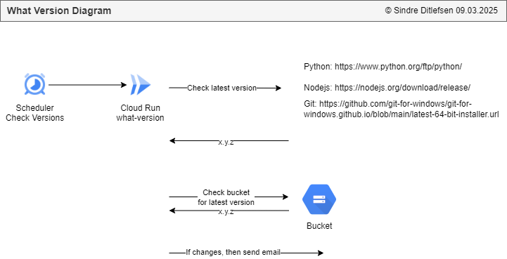

# 🔄 User Feedback Form 

[🏠 Home](../)
&nbsp; &nbsp;
[⬅ 🎯 Projects Included](../#-4-projects-included)

Fetches API data and posts updates to Slack.

| Category     | Details                               |          
|--------------|---------------------------------------|
| Tech         | Python                                |
| Runs on      | Cloud Run Functions                   |
| GCP Services | Buckets, Email, Secrets and Scheduler |


#  

Table of contents:
1. [📖 Learning Objectives for What Version](#-1-learning-objectives)
2. [✨ Lessons Overview for What Version](#-2-lessons-overview)
3. [🚀 Create Flask Application for What Version](#-1-getting-started-with-user-feedback-form)
4. [☁️ Configure Google Cloud Infrastructure](#%EF%B8%8F-4-running-user-feedback-form-on-google-cloud-run)
5. [⚡ Configure CI/CD with Github Actions](#%EF%B8%8F-4-running-user-feedback-form-on-google-cloud-run)
6. [🕒 Setup a Google Cloud Scheduler](#Setup a scheduler)
7. [💻 Implementing Check for New Versions](#%EF%B8%8F-7-implementing-email)
8. [✉️ Implementing Email Message if There Are New Version](#%EF%B8%8F-7-implementing-email)
9. [🖥️ Running the Finished What Version Locally](#%EF%B8%8F-3-running-the-finished-user-feedback-form-locally)
10. [☁️ Running the Finished What Version on Google Cloud Run Functions](#%EF%B8%8F-4-running-the-finished-user-feedback-form-on-google-cloud-run)
11. [📜 License](#-5-license)

---

## 📖 1 Learning Objectives for What Version

TODO

---

## ✨ 2 Lessons Overview for What Version

1. **Introduction**

2. **Create Flask application**<br>
- Create a new application locally and push it to Github.<br>
- Activity: Import the project into Snyk. Are there any errors?

3. **Configure Google Cloud Infrastructure** <br>
- Setup a GCP project, service account, bucket and the Cloud Run Functions Flask application.<br>
- Activity/Reflection: TODO

4. **Configure CI/CD with Github Actions**<br>
- Create a service account, a Pool and Github Actions file
- Activity/Reflection: TODO

5. **Setup a scheduler**<br>
- Create a new Google Cloud Scheduler that checks for new versions every month
- Reflection: How often should the scheduler run?

6. **Implementing Check for New Versions**<br>
- Program the check for new versions
- Activity/Reflection: 

7. **💻 Implementing Email Message if There Are New Version**<br>
- If there are any new versions we want an email
- Activity/Reflection: 

8. **Congratulations and Learning Tip**<br>
- 
-  Reflection:

9. **Quiz**


---

## 🚀 1 Getting Started with What Version

**1. Create new application in Github**

**2. Open application in PyCharm**

Pycharm > File > Close Project<br><br>

Pycharm > Get from VCS<br><br>


**3. Add requirements.txt**

```
functions-framework         # Added by YOUR_NAME. Framework for running Google Cloud Functions locally.
google-cloud-storage        # Added by YOUR_NAME. Interact with Google Cloud Storage for file operations.
```

**4. Create main.py**

```python


import flask
import functions_framework

@functions_framework.http
def main(request: flask.wrappers.Request):
    """HTTP Cloud Function"""
    log_headline: str = f"main()"
    print(f"{log_headline} · Init")


if __name__ == '__main__':
    print("what-version local run")

    app = flask.Flask(__name__)  # Create a Flask app instance
    request = flask.request
    main(request)
```

**5. Install requirements**

PyCharm > Terminal:

`pip install -r requirements.txt`

**6. Run application**<br>
In PyCharm go to main.py and click `Run`


---

## 📦 2 Python Utils and Functions


---

## 🖥️ 3 Running the Finished What Version Locally

**1. Clone the repository**

**2. Open the directory `what-version` in PyCharm**


**3. Install requirements**

PyCharm > Terminal:

`pip install -r requirements.txt`

**4. Start the application**<br>
In PyCharm go to main.py and click `Run`


---

## ☁️ 4 Running the Finished What Version on Google Cloud Run Functions

### 1. Create service account `Cloud Scheduler Service Account for Cloud Run and Functions` (one time setup)

IAM > Service accounts > + Create Service Account

* Name: **Cloud Scheduler Service Account for Cloud Run and Functions**
* Description: **This is used for Google Cloud Scheduler. It can read secrets and invoke functions**

Permissions/Assign Roles:
* Cloud Scheduler Service Agent
* Service Account Admin


### 2. Create bucket

**Create Bucket:**

Buckets > [Create]

Get started:
* Name: **what-version-bucket**
* Labels: owner: YOUR_NAME

Location type:
* Region - europe-north1

[Create]


### 3. Deploy on Cloud Run Functions

```commandline
gcloud auth login
gcloud functions deploy what-version --gen2 --runtime=python312 --region=europe-north1 --source=. --entry-point=main --trigger-http --timeout=540 --verbosity=info --project=applications-dev --memory=512MB
```


---

## 📜 5 License


This project is licensed under the
[Creative Commons Attribution-NonCommercial-NoDerivatives 4.0 International License](https://creativecommons.org/licenses/by-nc-nd/4.0/).

**⚠️ Warning: Educational Material Only**

This repository contains projects and resources created for educational purposes as part of the Udemy course 
`Python, Next.js, PostgreSQL and DevSecOps on Google Cloud Platform with Projects from Real Industry`.

**This code is not intended for production use** and is provided **"as is"**. 
Use it at your own risk. No warranties or guarantees are provided, either express or implied. 

This material is **for students** enrolled in the course and is not meant to be used as part of any commercial product or service. 
Do not use the code as part of any production environment without thorough testing, modification, and security review.

